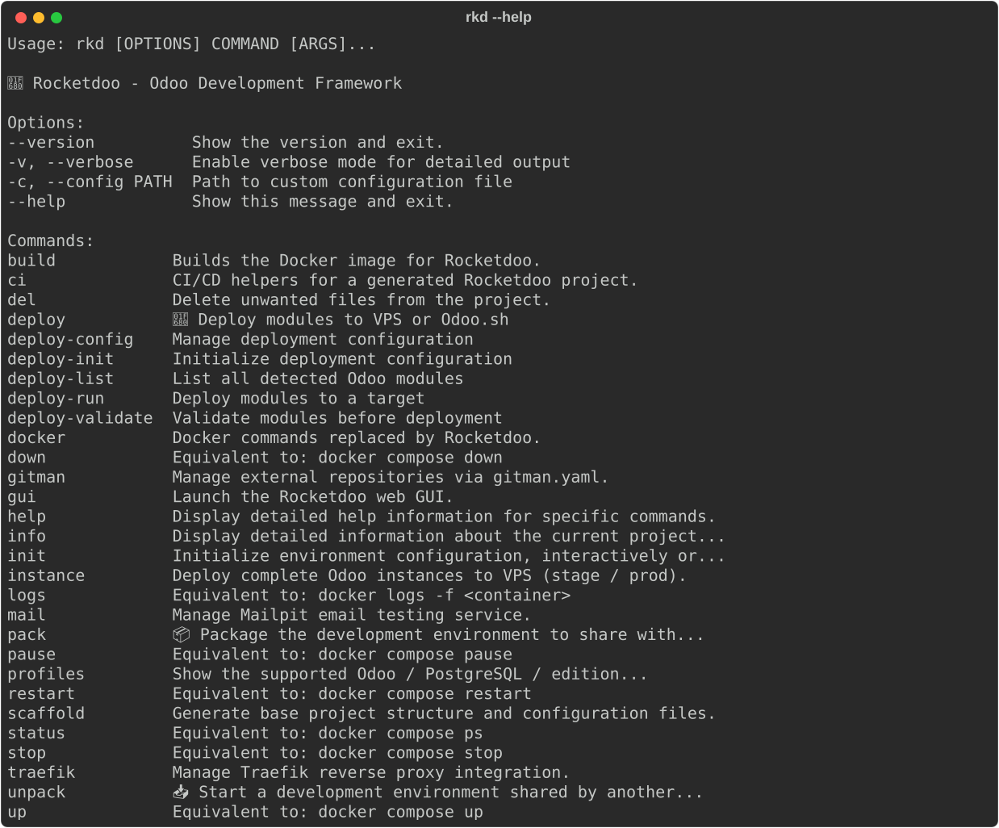
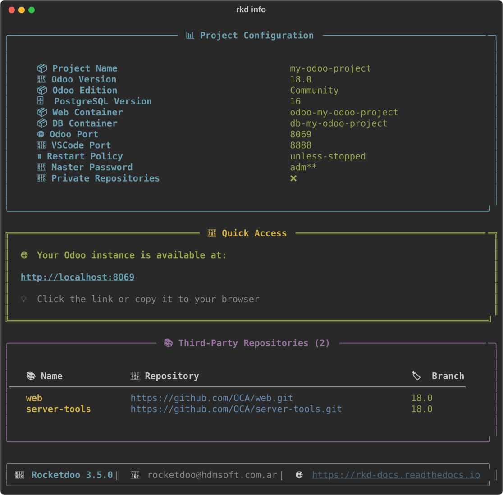
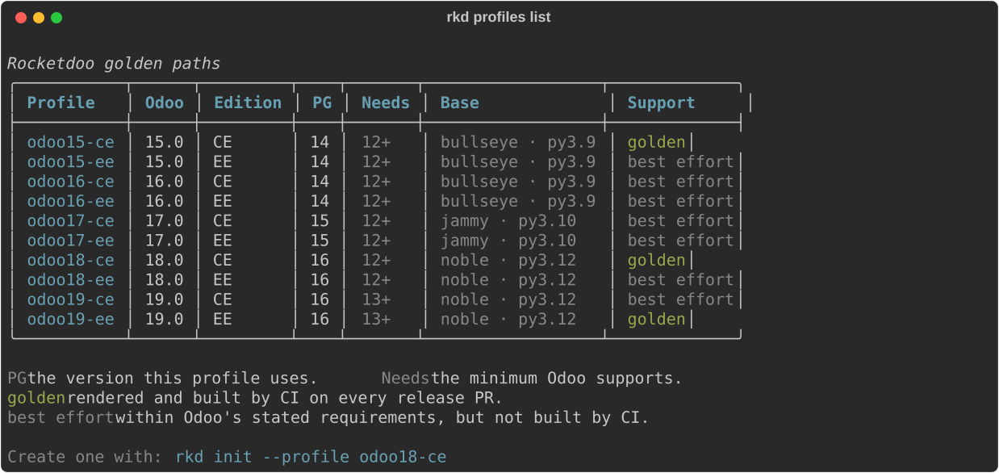
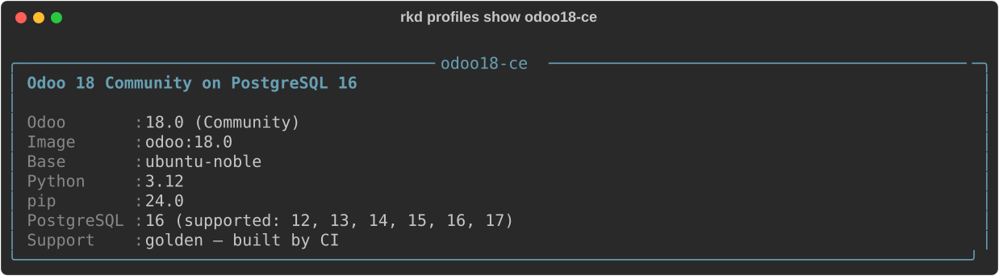
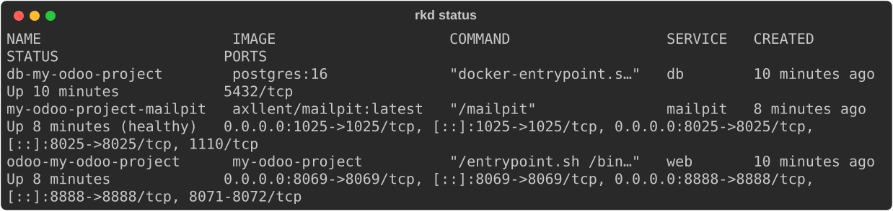
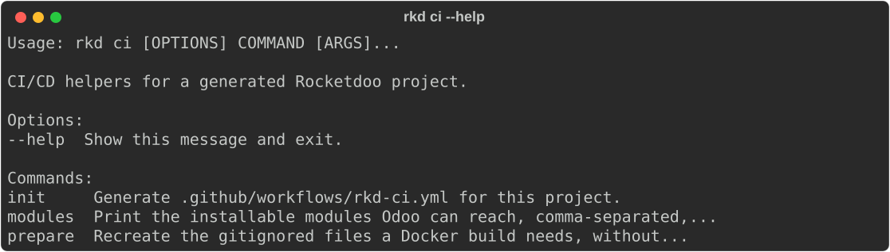
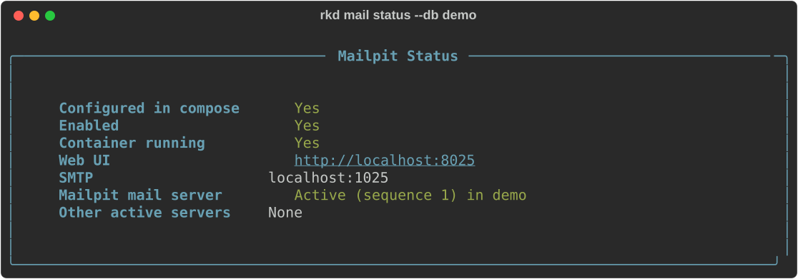
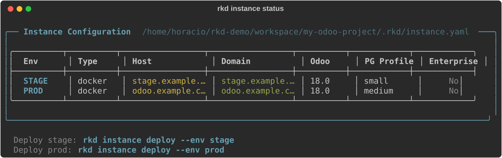

# Command Line Interface

Here are the most common commands you can use in **RKD** **ROCKETDOO**.

> You can use either `rocketdoo` or the shorter alias `rkd` — both are equivalent.

> **TIP:** Combine any command with `--help` to see its flags and options.  
> Example: `rkd build --help`

---

## General

* Display Rocketdoo version:

~~~
rkd --version
~~~

* Display help and available commands:

~~~
rkd --help
~~~

---

## Project Setup

* Generate the directory and file structure:

~~~
rkd scaffold
~~~

* Launch the initialization wizard:

~~~
rkd init
~~~

* Or create the environment straight from a supported profile, with no questions asked:

~~~
rkd init --profile odoo18-ce
~~~

* Display detailed information about the current project:

~~~
rkd info
~~~

> Since 3.5, `rkd info` also warns when a module under `addons/` sits in a subdirectory that Odoo's
> `addons_path` does not cover. It only warns, never writes. What writes the path: `rkd up`,
> `rkd restart`, `rkd build --rebuild`, `rkd ci prepare`, the GUI's Up and the per-module update.

---

## Golden Paths (`rkd profiles`)

> **New in 3.2.** A *golden path* is a named, supported combination of Odoo version, edition and
> PostgreSQL version. Rocketdoo ships ten of them, and they are the source of truth for both the
> `rkd init` wizard and `rkd init --profile`.

* List the whole matrix:

~~~
rkd profiles list
~~~

* Show the details of a single profile:

~~~
rkd profiles show odoo18-ce
~~~

* Create that environment end to end, without the wizard:

~~~
mkdir my-project && cd my-project
rkd scaffold
rkd init --profile odoo18-ce
rkd up -d
~~~

### Support levels

| Level | What it means |
|---|---|
| **golden** | CI renders **and builds** this combination on every release PR. These are the ones to choose. |
| **best effort** | Within Odoo's stated requirements and offered by the wizard, but not built by CI. Reports are welcome, but there is no guarantee. |

The golden combinations today are `odoo15-ce`, `odoo18-ce` and `odoo19-ee`: between them they cover
the three different base images the `odoo:` images use, and both editions.

### Compatibility matrix

Per-image data was read from the published `odoo:` images; the PostgreSQL minimums come from Odoo's
own installation documentation.

| Odoo | Base | Python | pip | Minimum PostgreSQL | Recommended |
|---|---|---|---|---|---|
| 15.0 | debian-bullseye | 3.9 | 20.3.4 | 12 | 14 |
| 16.0 | debian-bullseye | 3.9 | 20.3.4 | 12 | 14 |
| 17.0 | ubuntu-jammy | 3.10 | 22.0.2 | 12 | 15 |
| 18.0 | ubuntu-noble | 3.12 | 24.0 | 12 | 16 |
| 19.0 | ubuntu-noble | 3.12 | 24.0 | **13** | 16 |

Odoo 19 raised the PostgreSQL minimum from 12 to 13. Rocketdoo now validates the pairing when the
profile is loaded: a `db_version` below the minimum for that Odoo version is an error, not a warning,
so the wizard can no longer produce an environment that will not start.

> **Odoo 19 and AI:** Odoo 19's AI features need the `pgvector` extension, which ships for
> PostgreSQL 15 and above. `rkd profiles show odoo19-*` warns you when the profile uses a lower version.

> **Enterprise:** any `*-ee` profile expects an `./enterprise` directory with the Odoo Enterprise
> add-ons (subscription required) next to `addons/` before you run `rkd up -d`.

---

## Container Management

* Deploy Odoo (start containers in detached mode):

~~~
rkd up -d
~~~

* Check the status of your containers:

~~~
rkd status
~~~

* Stop all containers:

~~~
rkd stop
~~~

* Restart the containers:

~~~
rkd restart
~~~

* Remove containers:

~~~
rkd down
~~~

* Remove containers and their associated volumes:

~~~
rkd down -v
~~~

* Force environment rebuild:

~~~
rkd build
~~~

* Build and restart containers in one step:

~~~
rkd build --rebuild
~~~

* View container logs:

~~~
rkd logs
~~~

* Follow logs in real-time for a specific container:

~~~
rkd logs <container_name> -f
~~~

---

## Environment Sharing

* Package your entire environment to share with other developers:

~~~
rkd pack
~~~

* Unpackage a shared `.zip` project into your directory:

~~~
rkd unpack
~~~

---

## Utilities

* Delete `.Identifier` files generated by WSL2 when copying files from Windows:

~~~
rkd del -i
~~~

* Preview which files would be deleted (dry run, no files removed):

~~~
rkd del -i --dry-run
~~~

* Bulk update module packages loaded as public repositories using Gitman:  
(This command must be executed inside the container.)

~~~
gitman update
~~~

---

## ⚙️ Continuous Integration (`rkd ci`)

> **New in 3.5.** `rkd ci` writes a GitHub Actions workflow **for your project** — not for
> Rocketdoo. It lints your addons and, optionally, installs them against a real Odoo.

* Generate `.github/workflows/rkd-ci.yml`:

~~~
rkd ci init
~~~

On a terminal this **asks you when the install job should run**, defaulting to `pull_request`.
Answer up front, or skip the question entirely:

~~~
rkd ci init -y                              # take the default, no question
rkd ci init --install-trigger never         # lint only
~~~

| Option | Description |
|--------|-------------|
| `--install-trigger` | When the install job runs: `pull_request`, `push`, `manual`, `never`. Asked interactively if omitted; `pull_request` without a terminal |
| `--force` | Overwrite a workflow that differs from the current render |
| `-y, --yes` | Skip the install-trigger question and take the default |

It never overwrites a file that differs from what it would write, without `--force`, whether the
difference came from you editing it by hand or from a config change. What it tells you: `Created:`
for a new file, *already up to date* when it matches, a warning naming `--force` when it differs,
and `Overwritten:` when you pass it.

* Regenerate the files a clean clone does not carry:

~~~
rkd ci prepare
~~~

`config/odoo.conf` and `odoo_pg_pass` are gitignored — they hold credentials — so a fresh clone does
not have them. The build copies `config/odoo.conf` into the image (`COPY ./config/odoo.conf`) and
compose feeds `odoo_pg_pass` in as a secret at startup, so without this step a clean checkout gets
nowhere. It also syncs the `addons_path`. It never overwrites an `odoo.conf` that already exists,
which is what the output above is reporting.

Pass `--admin-passwd` to set the master password it writes; otherwise one is generated.

* List the installable modules Odoo can actually reach:

~~~
rkd ci modules
~~~

Prints them comma-separated on stdout, for `MODULES=$(rkd ci modules)` inside the workflow.

### What the generated workflow does

| Job | When it runs | What it costs |
|-----|--------------|---------------|
| **Lint** | Every pull request, pushes to the default branch, and manually | Seconds |
| **Install** | Pull requests against the default branch, by default | Several minutes |

The workflow triggers on `pull_request`, on `push` **to the default branch only**, and on
`workflow_dispatch`. Pushing a feature branch with no pull request open runs nothing. The lint job
runs `ruff check` over `addons/` and then `rkd deploy validate -p addons`.

The install job is the expensive one, which is why it is limited by default. On **private** repos
the Free plan gives 2,000 Actions minutes a month shared across your whole account; **public** repos
do not consume that quota. Change the trigger with `--install-trigger` if that split does not suit
you.

> Those numbers are GitHub's, not Rocketdoo's, and GitHub changes them:
> [check the current Actions billing](https://docs.github.com/en/billing/managing-billing-for-github-actions/about-billing-for-github-actions).

**Manifest linting.** Ruff's default rules flag `B018` on every `__manifest__.py` — by Odoo's own
definition it is a bare dict literal — so the generated workflow passes
`--extend-per-file-ignores "**/__manifest__.py:B018"`. Without it the lint job is red on every Odoo
project.

> `rkd ci init` signs off with *"the lint job runs ruff with its default rules"*. The generated
> workflow does add the exception above — the message is the thing that is imprecise, not the
> workflow.

### What is outside the generated path

- **Enterprise, and private repos over SSH.** The workflow is still written, without the install job
  and with the reason as a comment: a runner has no access to your private sources.
- **Private Gitman sources.** `rkd ci init` warns if `gitman.yaml` has `git@`/`ssh://` sources, but
  it cannot tell a private HTTPS repo from a public one — that build fails on the runner with no
  warning up front.
- **Deploying to staging.** Deliberately left out for now: `rkd deploy` has no headless way to
  generate a `deploy.yaml`, so the generated workflow only lints and installs.

---

## 📧 Mail — Mailpit Email Testing (`rkd mail`)

Mailpit is a local SMTP server and web UI that captures all outgoing emails from Odoo instead of actually sending them. Ideal for testing email workflows without affecting real users.

* Enable Mailpit (start service + configure Odoo SMTP automatically):

~~~
rkd mail on
~~~

* Disable Mailpit and restore default SMTP settings:

~~~
rkd mail off
~~~

* Check the current Mailpit status:

~~~
rkd mail status
~~~

* Open the Mailpit web interface in the browser:

~~~
rkd mail open
~~~

> Mailpit web UI is available at `http://localhost:8025` when active.

### The mail server record in Odoo

> **New in 3.3.** On top of the compose and `odoo.conf` toggle, `on`/`off`/`status` now read and
> write an `ir.mail_server` record in your database, named **`Mailpit (rkd)`**, with
> `smtp_host = mailpit` and `sequence = 1`. Before this, enabling Mailpit configured the transport
> but left Odoo still pointing at whatever mail server the database had.

`off` only archives the record (`active = false`) — it never deletes, so a mail server of your own
is never at risk. The record is matched by name plus `smtp_host`: if you rename it by hand, `off`
will not find it (and says so) and `on` will create a new one.

**Multi-database projects need `--db`:**

~~~
rkd mail on --db my_database
rkd mail status --db my_database
rkd mail off --db my_database
~~~

With exactly one database in the project it is picked automatically. With two or more and no
`--db`, the command neither reads nor writes the record, and tells you.

The `db` container has to be up for this part. If it is not, the compose and `odoo.conf` toggle
still happens and the mail server step is reported as not done — run `rkd up -d` and retry the same
command.

> **Known limit.** `sequence = 1` does not guarantee Mailpit wins. Odoo filters mail servers by
> `from_filter` *before* ordering by `sequence`, so another active server whose `from_filter`
> matches the sender can beat Mailpit anyway. `rkd mail status` warns when other active servers
> exist, but it does not read or write `from_filter`.

---

## 🌐 Traefik Reverse Proxy (`rkd traefik`)

Traefik allows you to expose your local Odoo instance using a custom domain, both for local development (HTTP) and production environments (HTTPS with Let's Encrypt).

* Enable Traefik for this project (interactive wizard — prompts for domain and mode):

~~~
rkd traefik on
~~~

* Enable with specific options:

~~~
rkd traefik on --domain myproject.local --mode local
rkd traefik on --domain myproject.com --mode production
~~~

* Disable Traefik for this project (restores direct port access):

~~~
rkd traefik off
~~~

* Show Traefik integration status:

~~~
rkd traefik status
~~~

* Show step-by-step guide to configure local domains (`/etc/hosts` and WSL2):

~~~
rkd traefik guide
~~~

> Traefik modes:
> - **local** — HTTP only, custom domain via `/etc/hosts`.
> - **production** — HTTPS with automatic Let's Encrypt certificate.

---

## 🚀 VPS Instance Deployment (`rkd instance`)

The `instance` command deploys a complete Odoo instance to a VPS. It supports two deployment types:

- **docker** — transfers Dockerfile + compose files and builds on the VPS.
- **native** — installs Odoo via official apt packages on the server.

* Configure stage/production environments interactively (saves to `.rkd/instance.yaml`):

~~~
rkd instance init
~~~

* Overwrite an existing configuration:

~~~
rkd instance init --force
~~~

* Deploy to the staging environment:

~~~
rkd instance deploy --env stage
~~~

* Deploy to production (with confirmation prompt):

~~~
rkd instance deploy --env prod
~~~

* Deploy to production skipping the confirmation:

~~~
rkd instance deploy --env prod --yes
~~~

* Preview generated files without deploying (dry run):

~~~
rkd instance deploy --env prod --dry-run
~~~

* Show status of all configured deployment targets:

~~~
rkd instance status
~~~

---

## 🖥️ Graphical User Interface (`rkd gui`)

Launch the Rocketdoo web GUI in your browser. Provides full container management, live logs, mail, deploy, and more — all without typing commands.

* Start the GUI on the default port (8070):

~~~
rkd gui
~~~

> **Since 3.4, read the URL it prints.** Every run generates a session token and the GUI does not
> load without it: `http://127.0.0.1:8070/?token=<token>`. Browsing to `http://localhost:8070` on
> its own gets you nothing, and restarting `rkd gui` invalidates the previous token. See
> [Graphical Interface (GUI)](gui.md#the-session-token).

* Start the GUI on a custom port:

~~~
rkd gui --port 9090
~~~

* Start the GUI and open the browser automatically:

~~~
rkd gui --open
~~~

* Start the GUI for a project in a specific directory:

~~~
rkd gui --cwd /path/to/project
~~~

> The GUI is available at `http://localhost:8070` by default — **on the tokenised URL it prints**.
> Press `Ctrl+C` to stop it.

>>> [Learn more about the GUI](gui.md)