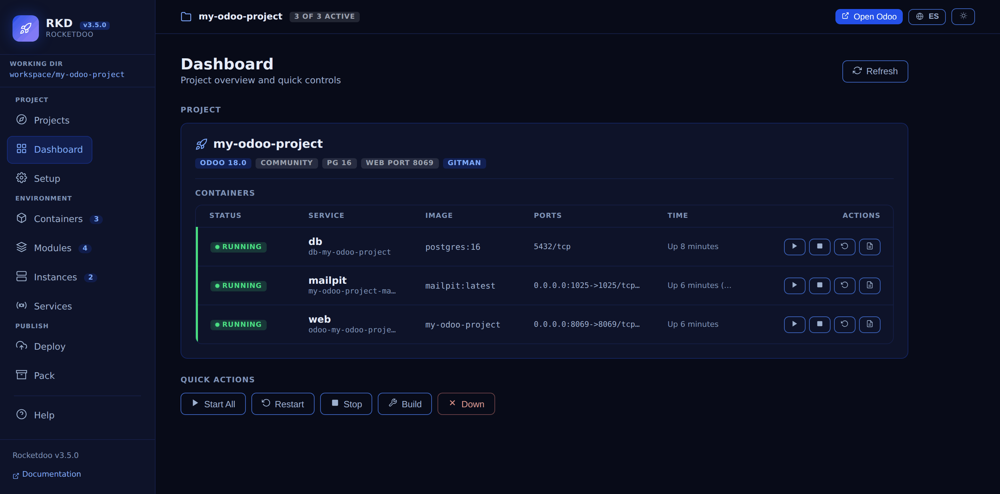
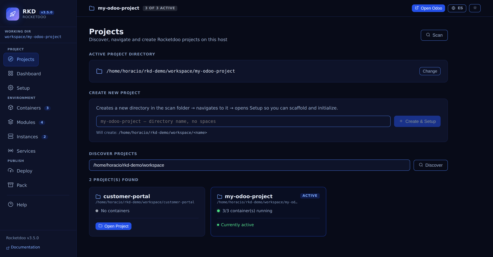
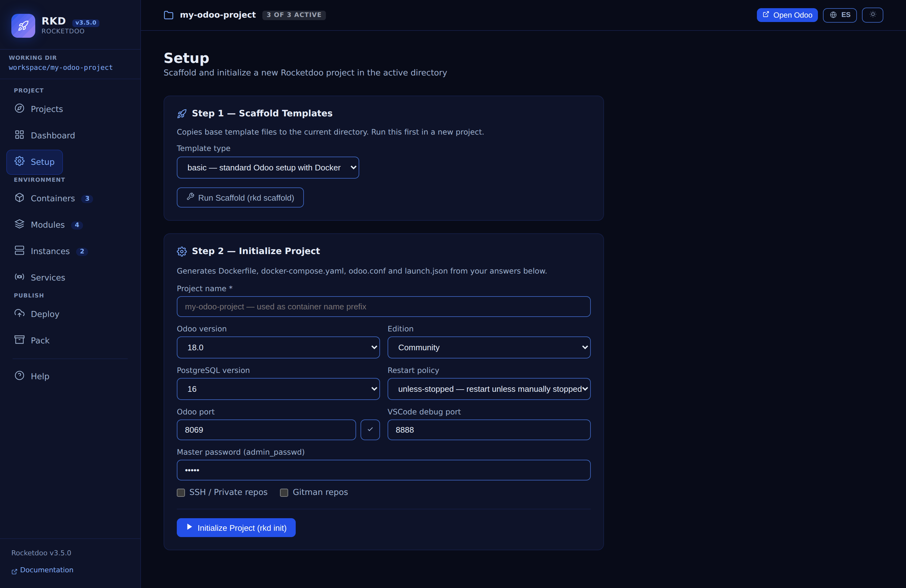
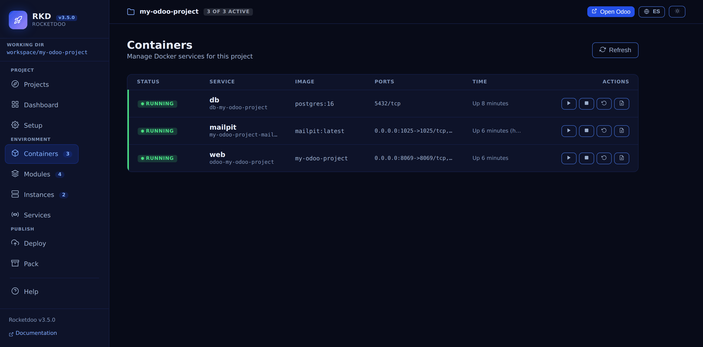
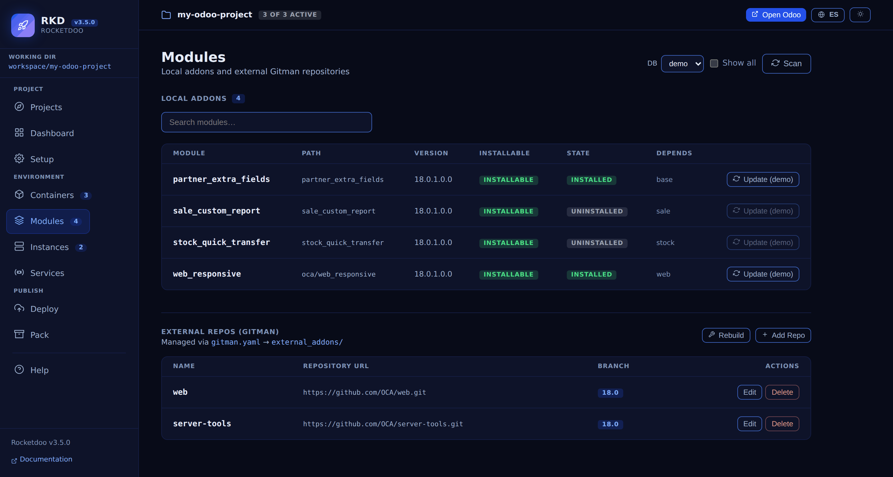
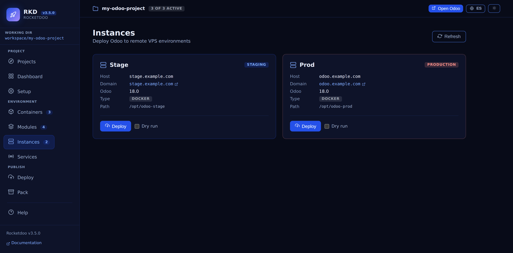
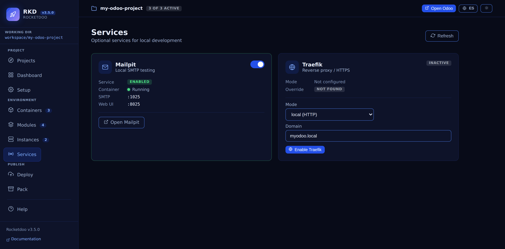
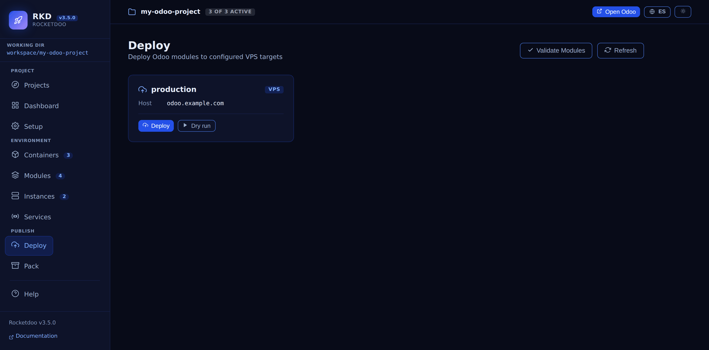
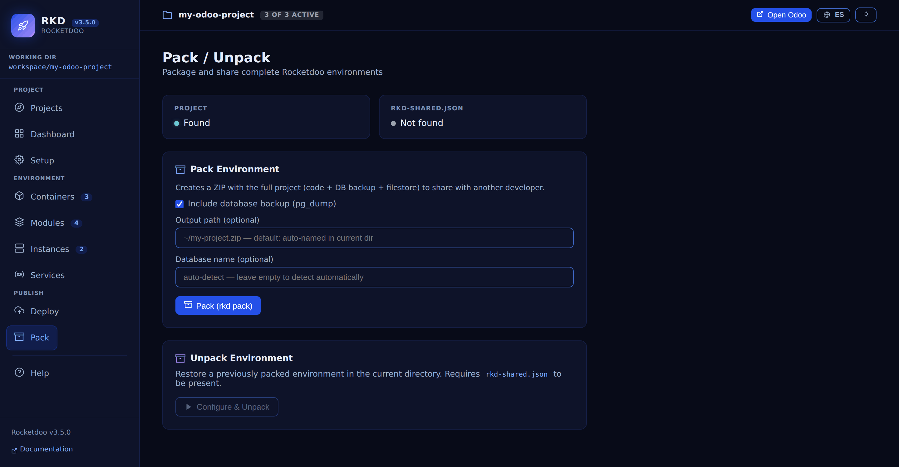
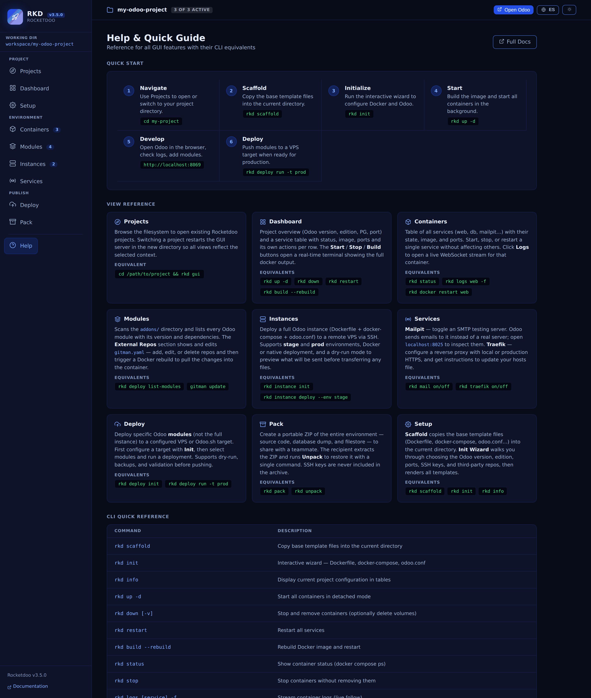

# Graphical User Interface (GUI)

**Rocketdoo** ships a web-based Graphical User Interface that lets you manage your entire Odoo
development environment from a browser — no Docker commands required.

> **Rebuilt in 3.5.** A permanent top bar that always names the active project, grouped sidebar
> navigation, a new **Projects** screen, a light theme that meets WCAG AA contrast, and a
> Spanish/English switch. Since 3.4 the API also requires a session token — see
> [The session token](#the-session-token), because it changes how you open the GUI.

## Starting the GUI

Launch the GUI from your project directory:

~~~
rkd gui
~~~

Rocketdoo prints the URL you have to open. **It carries a session token, and without it the GUI
shows you nothing but a notice asking for one:**

~~~
  Open this URL (it carries the session token):

  http://127.0.0.1:8070/?token=B0aITaQp0PaUQLodowmXCFGafXJtabZZQr-twSnxNIs
~~~

Press `Ctrl+C` in the terminal to stop the server.

### Options

| Option | Description | Default |
|--------|-------------|---------|
| `--port` | Port to run the GUI server on | `8070` |
| `--host` | Host address to bind | `127.0.0.1` |
| `--open` | Open the browser automatically on that exact URL | `false` |
| `--cwd` | Project directory (if different from current) | current dir |

**Examples:**

~~~
rkd gui --port 9090             # Custom port
rkd gui --open                  # Open the browser on the tokenised URL
rkd gui --cwd /path/to/project  # Specific project directory
~~~

### The session token

Every `rkd gui` run generates a fresh token that lives only in the server's memory. The API
(`/api/*` and `/ws/*`) rejects any request that does not carry it: `401` over HTTP, and the socket
is closed for WebSockets. Three consequences worth knowing:

- **Browsing to `http://localhost:8070` on its own no longer gets you a working GUI.** The page
  itself still loads — `/`, `/health` and the SPA are exempt — but every call for data is refused,
  so it shows *Session token required* instead of failing silently. Use the printed URL, or `--open`.
- **Restarting `rkd gui` invalidates the previous token.** Old tabs stop working; reopen the new URL.
- The token travels as a query parameter, so it can end up in your browser history. The full threat
  model is in [SECURITY.md](https://github.com/HDM-soft/rocketdoo/blob/main/SECURITY.md).

---

## Interface overview

Three parts are always on screen:

- **The top bar** names the active project and shows a pill with how many containers are running
  (`3 of 3 active`), plus **Open Odoo**, the language switch and the theme switch. The full project
  path is in the tooltip of the project name.
- **The sidebar** groups the ten screens into **Project** (Projects, Dashboard, Setup),
  **Environment** (Containers, Modules, Instances, Services) and **Publish** (Deploy, Pack), with a
  counter next to Containers, Modules and Instances. Help sits on its own at the bottom. The
  **Working dir** pill at the top is also the shortcut back to Projects.
- **The main area** holds the screen you selected.

### Language and theme

Two buttons in the top bar:

- **ES / EN** switches the whole interface between Spanish and English. With no saved choice it
  follows your browser language. What the GUI only relays is deliberately left untouched in either
  language: Docker logs, addon names and versions, container and image names, and the raw status
  from `docker compose ps` (`Up 3 hours`).
- **The sun/moon button** switches between the light and dark theme. With no saved choice it follows
  your operating system; once you press it, your choice persists across restarts. The screenshots on
  this page use the dark theme.

---

## The screens

### Projects

Find and move between Rocketdoo projects without restarting the server.

- **Active project directory** — what every other screen is acting on; **Change** picks another.
- **Create new project** — makes a directory and takes you straight to Setup.
- **Discover projects** — scans a folder recursively and lists every Rocketdoo project it finds,
  each with its container count and an **Open Project** button — the one you are already on says
  *Currently active* instead.

### Dashboard

The project at a glance: Odoo version, edition, PostgreSQL version, web port and Gitman shown as
compact pills, then the service table, then the quick actions (**Start All**, **Restart**, **Stop**,
**Build**, **Down**).

The screen shows a single primary action depending on state: **Open Odoo** in the top bar when the
Odoo container is running, **Start All** on the screen itself when it is not.

### Setup

The `rkd scaffold` and `rkd init` wizard, from the browser: template type, project name, Odoo
version, edition, PostgreSQL version, restart policy, Odoo and VSCode debug ports, master password,
SSH/private repos and Gitman repos. Two buttons run the steps — **Run Scaffold** and **Initialize
Project**.

### Containers

The same service table as the Dashboard. Each row carries its own start, stop, restart and logs
buttons; logs stream live over a WebSocket.

> At narrow widths (around 1100px) the table needs horizontal scrolling to reach the Actions column.

### Modules

Everything about addons in one screen:

- **Local addons** — every module under `addons/`, with its path, version, whether it is installable
  and, picking a database in the **DB** selector, **whether it is installed in that database**. The
  **Update** button per module runs the update with a live log.
- Nested modules are found too: `oca/web_responsive` in the screenshot lives in a subdirectory, and
  since 3.5 Rocketdoo adds that subdirectory to Odoo's `addons_path` so it is actually reachable.
- **External repos (Gitman)** — read and edit `gitman.yaml` and trigger a Docker rebuild.

### Instances

A card per environment configured in `.rkd/instance.yaml` (stage, prod) with host, domain, Odoo
version, deployment type and remote path, plus **Deploy** and a **Dry run** checkbox.

### Services

The optional local services, together:

- **Mailpit** — the toggle enables or disables it, and the card reports the service state, the
  container, the SMTP port and the web UI port, with a button to open it.
- **Traefik** — the current mode and whether the override file exists, with a mode selector
  (local HTTP / production HTTPS), the domain and **Enable Traefik**.

### Deploy

Deploy modules to the targets configured in `.rkd/deploy.yaml`, with **Validate Modules**, **Deploy**
and a **Dry run** checkbox — the GUI equivalent of `rkd deploy run`.

### Pack

Package the environment to share it (`rkd pack`) choosing whether to include the database backup,
the output path and the database name, or restore one you received with **Configure & Unpack**.

### Help

A reference for every GUI feature next to its CLI equivalent, so moving between the two is a lookup,
not a guess.

---

## Notes

- The GUI drives your local Docker engine through the CLI — Docker has to be running for the
  container actions to work.
- Log streaming uses WebSockets; keep the tab open while you follow logs.
- No internet access is needed: everything runs locally.
- Changes made from the GUI (Mailpit, Traefik, Gitman) land in your project files right away
  (`docker-compose.yaml`, `odoo.conf`, `gitman.yaml`, `.rkd/traefik.yaml`).
- **Since 3.2** the API only accepts browser requests from the GUI's own origin — the host and port
  it was started on, so `--port` and `--host` keep working. Earlier versions accepted any origin:
  while `rkd gui` was running, any page you visited could list your filesystem and stop your
  containers. Binding to `127.0.0.1` was never protection against that, since the request comes from
  your own browser. Upgrade if you use the GUI.
- **`rkd gui --host 0.0.0.0` is not the recommended setup.** Exposed that way the token is the only
  barrier left, and it travels over plain HTTP.
