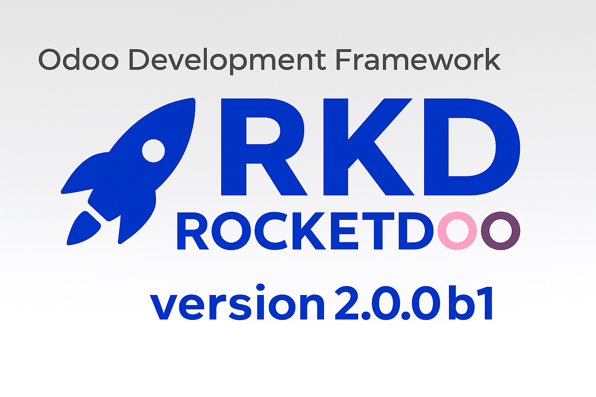

# Welcome to RKD as ROCKETDOO!

> Now the version 2 of ROCKETDOO with its alias RKD

Rocketdoo is a Python-based framework designed to provide a fast and efficient development environment.

With Rocketdoo, you can deploy one or several environments for Odoo development in just a few simple steps.
It allows you to create new modules or features for both the Enterprise and Community editions.

## What's New in ROCKETDOO Version 2

The new version of **ROCKETDOO** now allows you to install the framework and start using the tool without needing
to create a repository from the old version 1.3.1 template.
Starting from this version, Rocketdoo is no longer a repository itself — which means you no longer need to rely on **Git** submodules,
something that for many developers was an unnecessary complexity.

From now on, you can naturally clone your custom and existing modules directly into the addons/ folder,
which is specifically designed for that purpose.

Additionally, as the title suggests, the new version of **ROCKETDOO** introduces its own alias for faster interaction — **RKD**.
This alias replaces the rocketdoo command, allowing you to simply type rkd while maintaining full compatibility;
you can use either command depending on your preference.

**RKD**, just like **ROCKETDOO**, now provides its own command set. Once the tool is installed, you can check the available commands
and their usage by running:
~~~~
rkd --help
~~~~
or the original command:

~~~~
rocketdoo --help
~~~~

Good news for those who are not fully comfortable with Docker or Docker Compose: **Rocketdoo** also includes the most important commands
to deploy and manage containers, replacing standard Docker and Docker Compose commands.
For example, instead of running ***docker compose up -d***, you can simply use ***rkd up -d*** and similarly for commands
to stop, remove, or get logs from your containers.

> Now Rocketdoo is more powerful and easier to use than ever before...

## Overview

This tool was designed for developers who are just getting started with Odoo, as well as for experienced developers
who want to quickly deploy environments and focus solely on building new modules and features.

It’s important to note that Rocketdoo is just one of many tools available in the Odoo development ecosystem.
It does not aim to be the only or the best option — rather, it’s a practical solution that adds value, covers common development needs,
and optimizes and automates the developer’s workflow.

We know that the Odoo ERP system is broad, powerful, and complex. Depending on the client, the business requirements,
or the localization being implemented, it’s necessary to consider a series of dependencies that go beyond pure development.
These may include required Python libraries, specific dependencies for certain features, third-party modules,
or external repositories needed to ensure a successful implementation.

All these requirements and configurations often become a real burden for developers.

That’s why Rocketdoo was created — to provide an automated and intuitive environment that serves both individual developers
and development teams. Rocketdoo simplifies the process of setting up a development environment
and lets you focus on what really matters: building new modules and features.

## Description

To better understand what Rocketdoo is and how to use it properly, let’s go through a brief description
of the required tools and their purpose.

First, it’s important to mention that Rocketdoo was designed and developed to create development environments
on Linux-based operating systems, such as Ubuntu or Debian. We consider Linux to be the most suitable system
for working with this framework for the following reasons.

Rocketdoo relies on the following tools to perform its functions:

* Docker y Docker Compose.
* Git y GitHub (or any version control manager).
* Llave SSH for managing private repositories.
* Gitman.
* Python and its packages manager `pip` or `pipx`.
* Command Line Interface (CLI) usage.
* Visual Studio Code.
* Required Visual Studio Code extensions (listed later)

This list of required tools — especially Docker and Docker Compose — is one of the main reasons
why we recommend using Rocketdoo on a Linux operating system.

However, we understand that many developers prefer using Windows. In that case,
we strongly recommend using the Windows Subsystem for Linux version 2: **WSL2**.
