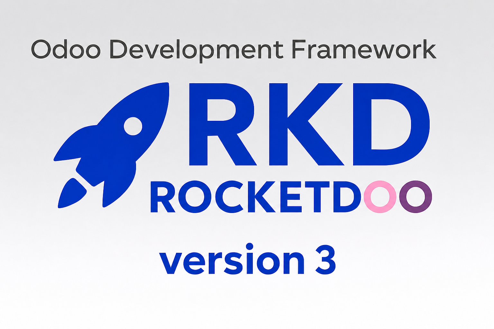

# Welcome to RKD as ROCKETDOO!

> Version 3 of ROCKETDOO — now with a Graphical User Interface, Mailpit integration, Traefik reverse proxy, and full VPS instance deployment.

Rocketdoo is a Python-based framework designed to provide a fast and efficient development environment.

With Rocketdoo, you can deploy one or several environments for Odoo development in just a few simple steps.
It allows you to create new modules or features for both the Enterprise and Community editions.

## What's New in ROCKETDOO Version 3

Version 3 is the most complete release of **ROCKETDOO** to date. It keeps everything from version 2 and adds four major new capabilities:

### 🖥️ Graphical User Interface (GUI)

**Rocketdoo v3** ships with its own web-based GUI, launched directly from the terminal with a single command:

~~~~
rkd gui
~~~~

The GUI opens in your browser at `http://localhost:8070` and provides:

- **Dashboard** — project overview with container status, Odoo version, PostgreSQL version, and quick access links.
- **Container controls** — start, stop, restart, build, pull, and remove containers without typing Docker commands.
- **Live log viewer** — real-time streaming logs from any container.
- **Mail (Mailpit)** — enable/disable the email testing service directly from the interface.
- **Modules** — list and manage Odoo add-on modules.
- **Deploy** — run deployment operations from the GUI.
- **Instance** — manage VPS deployment targets.
- **Pack / Unpack** — share or restore full development environments.
- **Gitman** — manage third-party repository dependencies.
- **Traefik** — configure the reverse proxy integration.
- **Dark and light mode** — toggle the theme to match your preference.

>>> [Learn more about the GUI](gui.md)

### 📧 Mailpit Email Testing (`rkd mail`)

The new `mail` command integrates [Mailpit](https://github.com/axllent/mailpit) — a local SMTP server and web UI that captures all outgoing emails from Odoo instead of sending them.

~~~~
rkd mail on       # Enable Mailpit and configure Odoo SMTP
rkd mail off      # Disable Mailpit and restore defaults
rkd mail status   # Show current status
rkd mail open     # Open the Mailpit web UI in the browser
~~~~

### 🌐 Traefik Reverse Proxy (`rkd traefik`)

The `traefik` command makes it easy to expose your local Odoo instance using a custom domain, either for local development or full production with HTTPS and Let's Encrypt.

~~~~
rkd traefik on      # Interactive setup: domain, mode (local/production)
rkd traefik off     # Remove Traefik integration from the project
rkd traefik status  # Show current Traefik configuration
rkd traefik guide   # Step-by-step guide for local domain setup
~~~~

### 🚀 Full VPS Instance Deployment (`rkd instance`)

The `instance` command allows you to deploy a complete Odoo instance to a VPS — either as a Dockerized build or as a native installation — using a simple interactive wizard.

~~~~
rkd instance init                # Configure stage/prod environments interactively
rkd instance deploy --env stage  # Deploy to staging
rkd instance deploy --env prod   # Deploy to production
rkd instance status              # Show configured deployment targets
~~~~

---

## From Version 2 — Still Available

All features from **ROCKETDOO v2** are fully preserved:

- `rkd scaffold` / `rkd init` — project scaffolding and configuration wizard.
- `rkd up`, `rkd down`, `rkd restart`, `rkd stop`, `rkd build`, `rkd status`, `rkd logs` — Docker container management.
- `rkd pack` / `rkd unpack` — share and restore full environments.
- `rkd del -i` — clean up `.Identifier` files created by WSL2.
- `rkd deploy` — module deployment to Odoo SH, VPS, or Dockerized instances.

On the following page, you can find detailed information about deployments using **rkd**. >>> [Deployment](deployment.md)

> Rocketdoo v3 is more powerful and easier to use than ever before...

## Overview

This tool was designed for developers who are just getting started with Odoo, as well as for experienced developers
who want to quickly deploy environments and focus solely on building new modules and features.

It’s important to note that Rocketdoo is just one of many tools available in the Odoo development ecosystem.
It does not aim to be the only or the best option — rather, it’s a practical solution that adds value, covers common development needs,
and optimizes and automates the developer’s workflow.

We know that the Odoo ERP system is broad, powerful, and complex. Depending on the client, the business requirements,
or the localization being implemented, it’s necessary to consider a series of dependencies that go beyond pure development.
These may include required Python libraries, specific dependencies for certain features, third-party modules,
or external repositories needed to ensure a successful implementation.

All these requirements and configurations often become a real burden for developers.

That’s why Rocketdoo was created — to provide an automated and intuitive environment that serves both individual developers
and development teams. Rocketdoo simplifies the process of setting up a development environment
and lets you focus on what really matters: building new modules and features.

## Description

To better understand what Rocketdoo is and how to use it properly, let’s go through a brief description
of the required tools and their purpose.

First, it’s important to mention that Rocketdoo was designed and developed to create development environments
on Linux-based operating systems, such as Ubuntu or Debian. We consider Linux to be the most suitable system
for working with this framework for the following reasons.

Rocketdoo relies on the following tools to perform its functions:

* Docker y Docker Compose.
* Git y GitHub (or any version control manager).
* Llave SSH for managing private repositories.
* Gitman.
* Python and its packages manager `pip` or `pipx`.
* Command Line Interface (CLI) usage.
* Visual Studio Code.
* Required Visual Studio Code extensions (listed later)

This list of required tools — especially Docker and Docker Compose — is one of the main reasons
why we recommend using Rocketdoo on a Linux operating system.

However, we understand that many developers prefer using Windows. In that case,
we strongly recommend using the Windows Subsystem for Linux version 2: **WSL2**.
