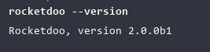
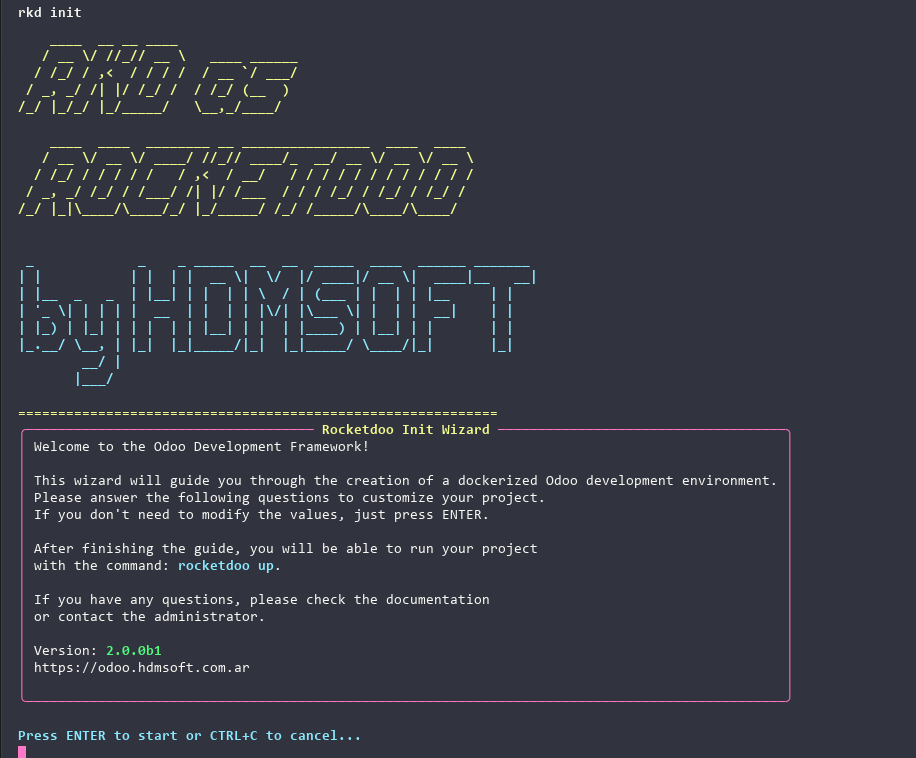
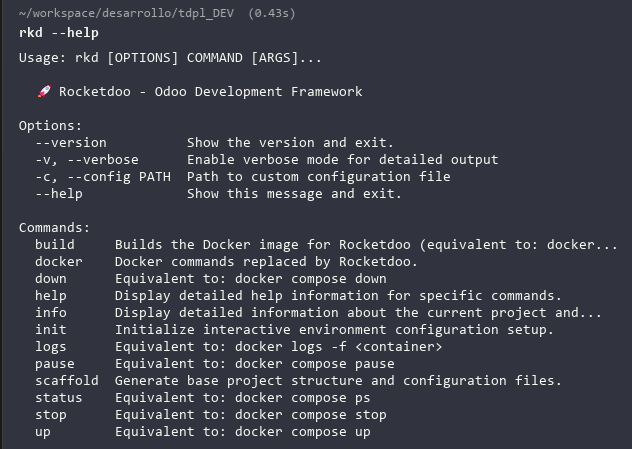

# Step by Step

### Step 1:

Verify that you have Docker and Docker Compose installed, as it is a tool as important as **Rocketdoo** itself.

### Step 2:

Install **Rocketdoo**

~~~~
pipx install rocketdoo
~~~~

### Step 3:

Install the requirements from the ***requirements.txt*** file if they were not installed by default:

~~~
sudo pip install -r requirements.txt
~~~

### Step 4:

Verify the installed version to ensure it is version 2; the old version will still be available.

~~~~
rocketdoo --version
~~~~

### Step 5:

Now you can create a directory of your choice to get started. However, it is recommended that your directory reference
a development intended for Odoo, which makes the most sense, right?

### Step 6:

Once you have created your working directory, keep it empty and once inside it, you can execute your first command:

~~~~
rkd scaffold
~~~~
This command will create all the necessary files and folders within your working directory to build your 
Odoo development environment and debug code with VSCode.

### Step 7:

Execute the command to start the **Rocketdoo** initialization wizard, which will guide you step by step through everything 
necessary to configure your development environment. 
Follow the steps and answer each and every one of its questions.

~~~
rkd init
~~~

### Step 8:

Once the wizard is complete, you can verify how your environment was built with the command:

~~~~
rkd info
~~~~

### Step 9:

With the following command you can now deploy your development environment:

~~~~
rkd up -d
~~~~

### Step 10:

Once the deployment has completed successfully, you can access it with your preferred browser using the URL:
http://localchost:{odoo-port}

## NOTES 

> Rocketdoo can determine if the ports chosen for Odoo and for debugging code with Visual Studio Code are 
occupied. In this way, if the chosen ports are occupied, the system will offer you two alternative ports
or the option for you to determine new ports of your choice.

> If you made an error during the wizard, you can cancel with the key combination **CTRL + C** and restart
without any issues.

## Learn Available Commands

With the following command you can see the help: 

~~~~
rkd --help
~~~~

---