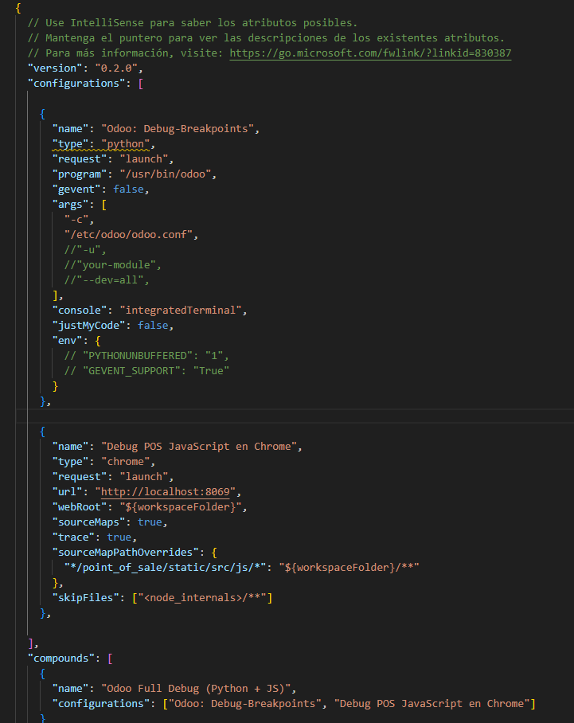

# Rocketdoo Structure

This section provides a detailed overview of how Rocketdoo is organized, enabling you to better understand its internal workings and grasp the significance and usage of key folders and files.

As shown in the image, there is an extensive list of folders and files that comprise the complete Rocketdoo structure.  
However, we will focus on the folders and files most relevant to developers.

These folders and files should be familiar to any Odoo developer.

---

## /Addons

First, let's discuss the **addons** folder.

Once your development environment is set up, whether working in Visual Studio Code or directly from the terminal, this folder will be used to host the developments you create, as well as some individually required modules.

You can create a folder with your module name and add its contents, or use the **Docker** extension for VSCode. With the *Attach Shell* option, you can open a terminal and navigate to the directory containing the modules:  
`/usr/lib/python/dist-packages/odoo/extra-addons`.

From there, you can use Odoo's **scaffold** command to generate a new module.

> **Important:** The "addons" folder within the development container is mapped as a volume to the "extra-addons" folder.  
> This is why we must navigate to that folder within the container.  
> Remember that the original `addons` folder belongs to the Odoo core, which becomes more evident when debugging code from within the container.

To create a new module using the `scaffold` command, execute it as follows:

~~~
odoo scaffold <my_module> .

~~~

This will generate a module with the necessary files and structure to start developing in the current directory.

Once created, the new module will also appear in your working environment within the **addons** folder in VSCode.

> **Remember:** The `addons` folder in your working directory is called `extra-addons` inside the Odoo container.

---

## /Config/odoo.conf

The **odoo.conf** file, located in the **/config/** directory, is particularly important for experienced Odoo developers.

This file contains all system configuration at the server level.  
It manages the mapping of third-party and custom modules, master password configuration, log file paths, and more.

However, do not worry, as you typically will not need to modify this file manually, since it is automatically configured during framework startup.

---

## Launch.json

Within the hidden *.vscode/* directory, you will find the ***launch.json*** file, which allows you to configure code debugging options within the development container.
This file provides two primary debugging types plus an additional configuration that combines both. These two main configurations allow you to choose between debugging Python backend code or the second option for debugging the POS (Point of Sale) for JavaScript developments.
The third option is a hybrid of both configurations simultaneously.
Additionally, we have some parameters that allow you to define what and how to restart your containers to quickly reflect the changes you are making. In these parameters, you can uncomment the lines:

//"-u",
//"your-module",
//"--dev=all",

and define the name of your module under development to update changes instantly.

---

## Enterprise

As you may have noticed, when launching **ROCKETDOO**, you are asked whether you wish to work with the Community or Enterprise version of Odoo.

Great! If your answer is `"ce"` (Community Edition), no additional steps are needed.

However, if your answer is `"ee"` (Enterprise Edition), it is very important that **before** launching Rocketdoo with the command ***rocketdoo up -d*** or ***rkd up -d***, you have the **Enterprise** folder in your working directory, at the same level as the **addons** folder.

This way, the system will be able to correctly map the Enterprise modules and perform the necessary configuration in the environment to run this Odoo edition.