# Despliegues

Esta nueva funcionalidad en **RKD** nos permite, durante o una vez finalizado y probado nuestros desarrollos de manera local; realizar
un despliegue del modulo en cuestion, hacia una ambiente Odoo, ya sea en Odoo SH como en un VPS o tambien en instancias del sistema
dockerizados.

Para realizar dicha accion nuestro framework ahora nos ofrece un conjunto de nuevos comandos para facilitar la configuracion de
nuestros targets de despliegue. Permitiendo que los modulos desarrollados puedan ser probados en un ambiente de desarrollo o 
de pruebas para nuestro equipo de funcionales o testers.

Ya no es suficiente con probar nuestros modulos en local y validar el funcionamiento correcto, sino que ahora podemos llevar
esta validacion a un punto mas aproximado a una instancia de produccion y a su vez permitir que el modulo ya quede de manera definitiva
en el sistema de nuestros clientes.

Dentro de este apartado en la documentacion, listaremos estos nuevos comandos y como usuarlos segun el caso...

-----------------------------------------------------------------------------------------------------------------

## Antes de comenzar:

> Es importante destacar que en nuestro ambiente de desarrollo, el directorio destinado para los modulos que desarrollemos es 
*addons/*
Por lo tanto siempre el programador Odoo, debera crear o clonar en este directorio el modulo con el que quiera trabajar, ya que el
framework por defecto buscara los modulos en dicho directorio.

---------------------------------------

## Comandos para los Despliegues:

~~~
rkd deploy --help
~~~

* Comando de ayuda para *deploy*

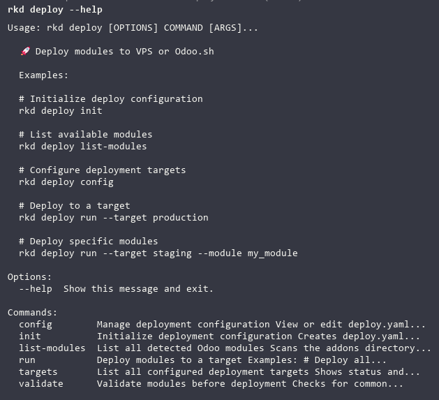

~~~
rkd deploy init
~~~

* Comando para dar comienzo a nuestra configuracion para realizar despliegues

~~~
rkd deploy list-modules
~~~

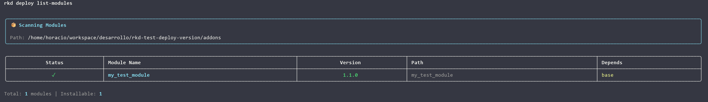

* Comando para listar los modulos preparados para lanzar el despliegue

~~~
rkd deploy config
~~~

* Comando para verificar de manera completa nuestros targets definidos para despliegues

~~~
rkd deploy run
~~~

* Comando para ejecutar el despliegue

~~~
rkd deploy run --target
~~~

* Nos permite determinar el target configurado para el despliegue

~~~
rkd deploy run --target <test> --module <my_module>
~~~

* Este comando nos permite determinar de manera mas enfatica que modulo deseamos desplegar

~~~
rkd deploy validate
~~~

* Permite validar nuestros modulos antes de un despliegue

---------------------------

## Despliegue en Odoo SH

Para comenzar es necesario primero que nada el desarrollador, debe tener acceso como desarrollador en el ambiente Odoo SH y permisos con su repositorio
para poder ejecutar un despligue en una instancia en Odoo SH. Por esto es clave tambien, en el momento de haber creado el ambiente de desarrollo, elegir
la opcion de gestionar repositorios privados; ya que esto le listara sus llaves ssh conectados con su repositorio en Github.

En esta y en todas las ocaciones de despliegue usaremos el comando:

~~~
rkd deploy init
~~~

Este comando nos dara inicio a la configuracion de nuestro depspliegue, siguiendo paso a paso los parametros necesarios para poder luego correr el 
despliegue de nuestra aplicacion.

Revisemos los pasos uno a uno: 

* Para esta ocasion nos informa que ya tenemos un despliegue configurado y nos indica si queremos sobre escribirlo.
* Luego nos indica si deseamos que autodetecte el o los modulos para desplegar. En el caso de tener mas de un modulo en el directorio *addons/*
es recomendable seleccionar "n" para "No" y luego pasar con el comando **--module <my_module>**
* Luego nos solicita el directorio donde se aloja el modulo, y por defecto nos indica *addons*, por ende escribimos **addons**.
* Determinamos que vamos a crear un target.
* Seleccionamos ahora en que ambiente realizaremos el despliegue y para este caso seleccionamos **Odoo SH**.

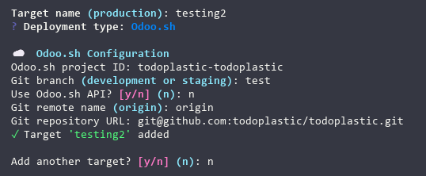

> Este apartado de es gran importancia definir los parametros solicitados, ya que corresponden al target como tal.

### Proyecto

* En la configuracion de Odoo.Sh nos pide primero, el ID del proyecto, el mismo lo podemos obtener verificando el proyecto en el dashboard
ya sea en su URl como tambien el nombre de este. Generalmente en la URL se puede ver de la siguiente manera:
*odoo.sh/project/id-de-proyecto*
donde *id-de-proyecto* es nuestro ID.

* Acto seguido nos solicita la rama de despliegue y nos sugiere por default las opciones *development or staging* donde es importante conocer
el nombre de la rama crada en *Staging* (en este ejemplo es "test"), en el caso de definir un nombre de rama que no existe en los estados del
proyecto, Odoo SH creara la rama durante el despliegue en el estado **Development**, como es habitual.

* En el siguiente paso nos pregunta si nos conectaremos con el ambiente mediante API. En este caso si el desarrollador tiene un token creado
puede usar esta configuracion o bien determinar NO para usar simplemente nuestro permiso en el repositorio.

* El nombre remoto de Git es el que casi de manera inequivoca se usa **origin** por esta razon nos sugiere por defecto esta opcion (RECOMENDADA).

* Por ultimo en esta etapa, es necesario copiar y pegar o escribir la URL del repositorio donde desplegaremos nuestra aplicacion.

* Luego de crear y nombrar nuestro target, nos indica que ha sido agregado, y nos solicita si deseamos crear un nuevo target..

### Configuracion de Copias de Seguridad.

* El sistema nos ofrece la opcion de crear copias de nuestros despliegues.

### Validaciones de nuestro modulo.

* En este segmento, nos pide validar la estructura de nuestro modulo.
* Y por ultimo nos indica que nuestra configuracion de despliegue se creo correctamente.

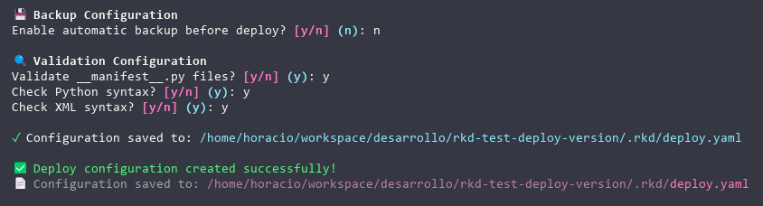

> Esto lo podemos ver tambien usando el comando **rkd deploy config**
el mismo nos listara todos los targets creados.

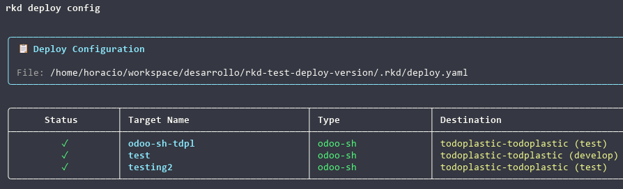

## Ejecutando un despliegue en ODOO SH

~~~
rkd deploy run --help
~~~

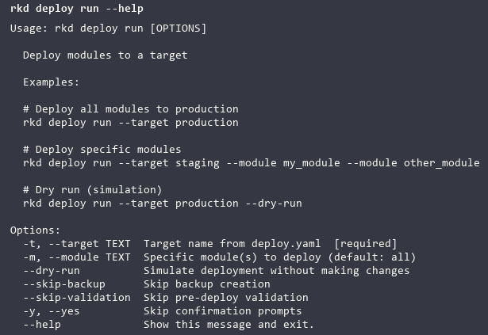

* Este comando nos muestra las opciones y banderas para lanzar el despliegue, recomendable determinar el target y el modulo cuando gestionemos mas de uno.

~~~
rkd deploy run --target "my target"
~~~

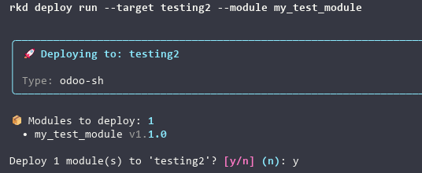

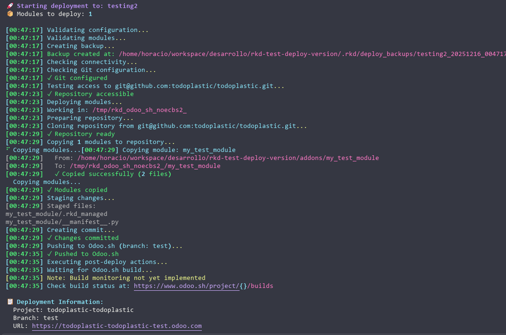

* Esta vista nos muestra todo el proceso de depliegue, donde podremos verificar los checks que **Rocketdoo** realiza, como por ejemplo, el acceso
al repositorio destino, si el modulo se copio de manera correcta y si se efectuaron los commits y push y al final nos deja un mensaje de despliegue
realizado satisfactoriamente.

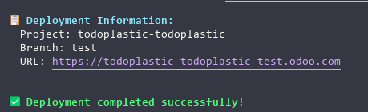

* Por ultimo podremos verificar en el panel administracion en la rama en cuestion de Odoo SH

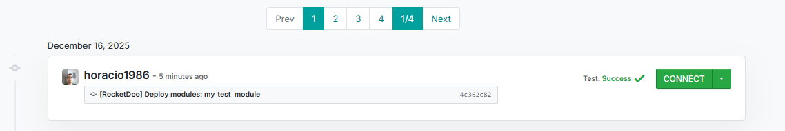

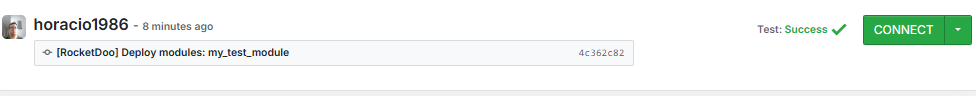

------------------------

## Despliegue en VPS (Nativo)

En este despliegue realizaremos los primeros pasos de la misma forma que lo hacemos para el despliegue de Odoo SH, solo que al momento de elegir
que tipo de Despliegue elegiremos, debera ser **VPS (Native)**

Luego es importante contar con la suficiente informacion del servidor destino, tales como:

1. La IP publica del servidor.
2. Puerto de conexion SSH habilitado en el servidor.
3. La llave SSH de conexion que usaremos para acceder al servidor. En el caso de no usar llave ssh
    el sistema indica que al momento del despliegue solicitara la contraseña.
4. Definir la llave SSH por su nombre, o escribir la contraseña del servidor.
5. La ruta de instalacion de Odoo en el servidor.
6. La ruta para los modulos en desarrollo o de terceros.
7. El nombre del serivcio Odoo en el servidor para reinicios.

