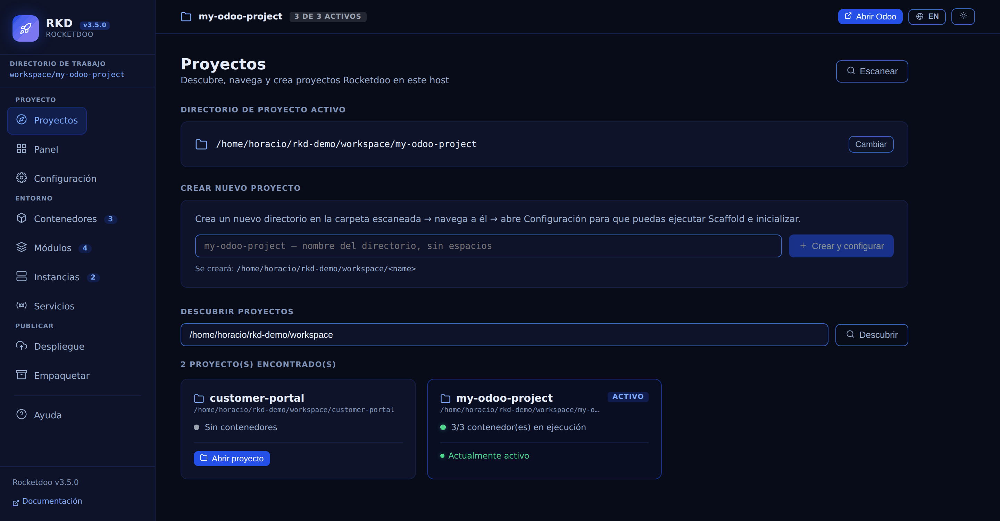
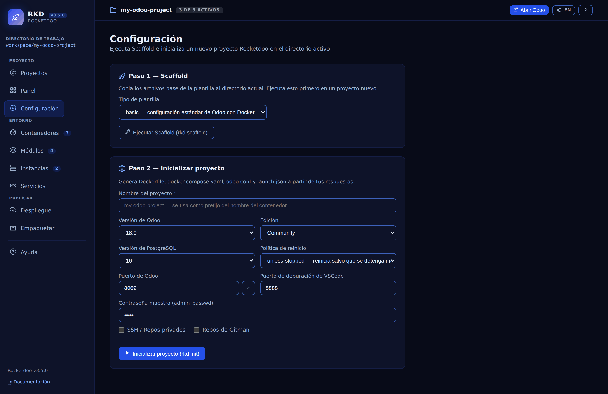
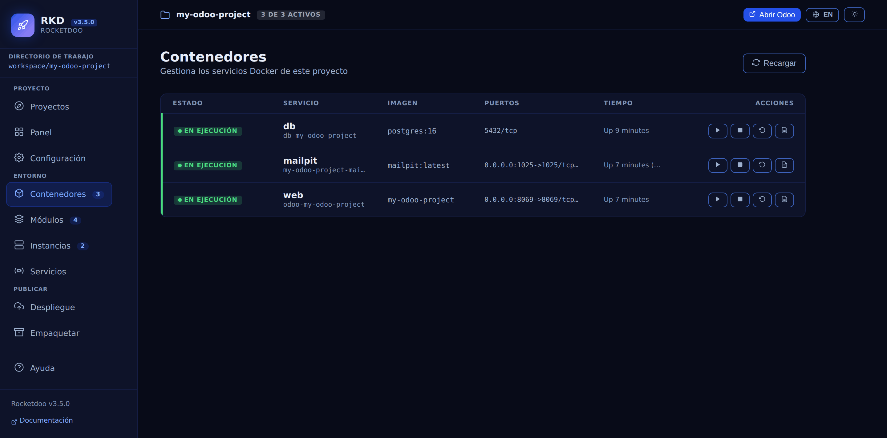
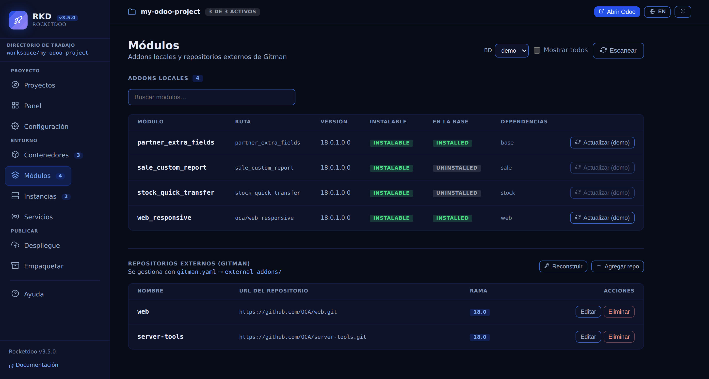
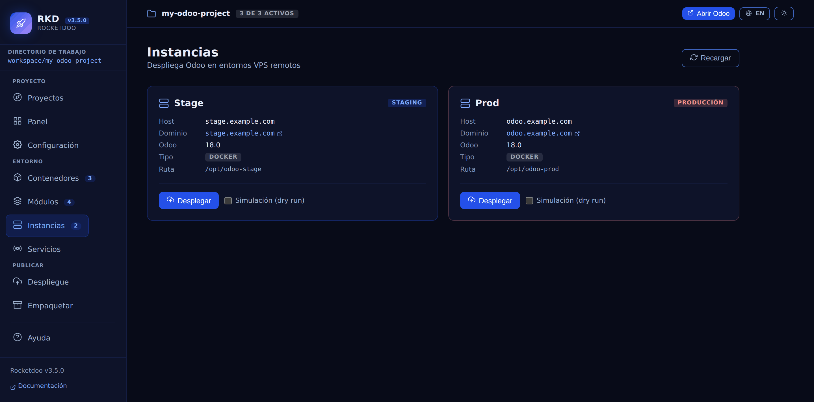
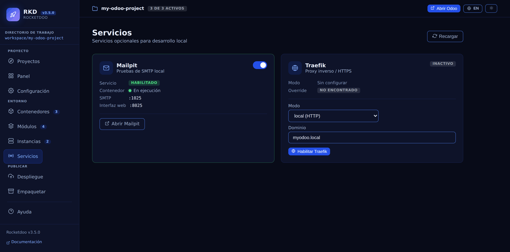
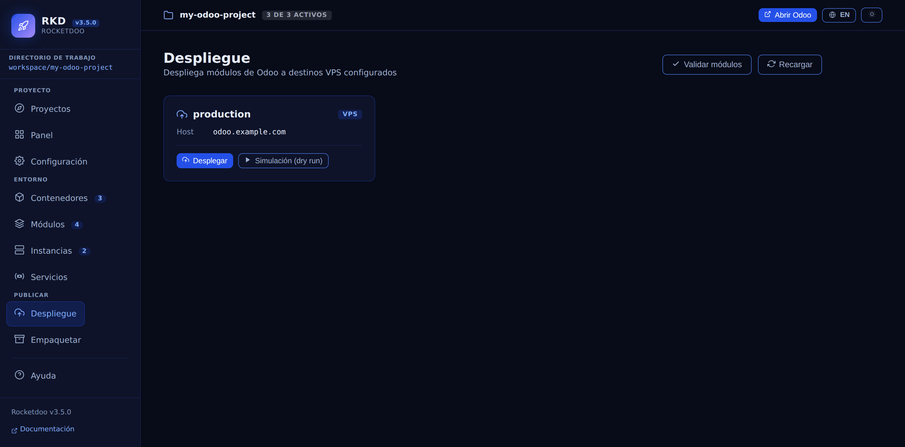
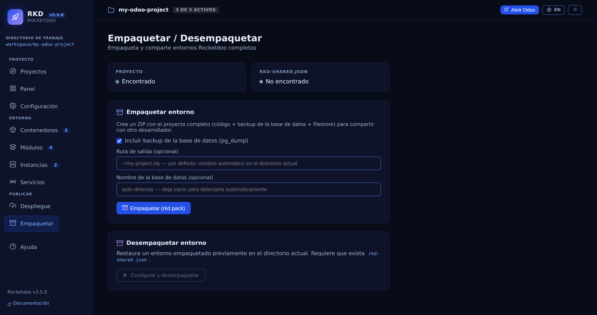
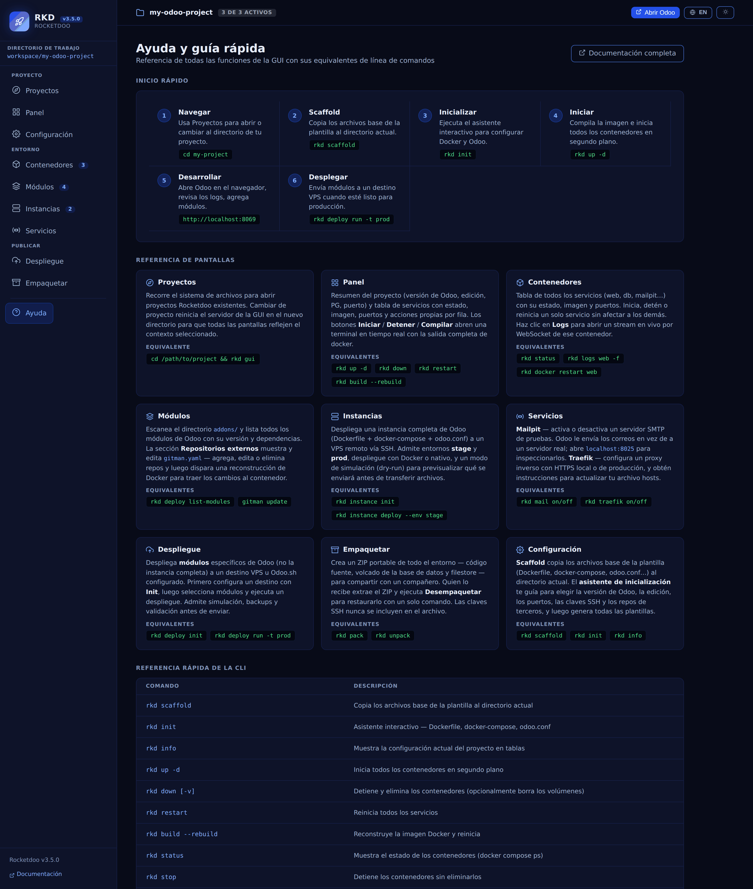

# Interfaz Gráfica (GUI)

**Rocketdoo** incluye una Interfaz Gráfica web que te permite gestionar todo tu entorno de
desarrollo Odoo desde el navegador — sin escribir comandos Docker.

> **Rediseñada en la 3.5.** Una barra superior fija que siempre dice en qué proyecto estás,
> navegación lateral agrupada, una pantalla **Proyectos** nueva, un tema claro que cumple contraste
> WCAG AA, y un selector español/inglés. Además, desde la 3.4 la API exige un token de sesión — mirá
> [El token de sesión](#el-token-de-sesion), porque cambia la forma de abrir la GUI.

## Iniciar la GUI

Lanzá la GUI desde el directorio de tu proyecto:

~~~
rkd gui
~~~

Rocketdoo imprime la URL que tenés que abrir. **Lleva un token de sesión, y sin él la GUI no te
muestra más que un cartel pidiéndote uno:**

~~~
  Open this URL (it carries the session token):

  http://127.0.0.1:8070/?token=B0aITaQp0PaUQLodowmXCFGafXJtabZZQr-twSnxNIs
~~~

Presioná `Ctrl+C` en la terminal para detener el servidor.

### Opciones

| Opción | Descripción | Valor por defecto |
|--------|-------------|-------------------|
| `--port` | Puerto en el que corre el servidor de la GUI | `8070` |
| `--host` | Dirección de host a usar | `127.0.0.1` |
| `--open` | Abrir el navegador automáticamente en esa URL exacta | `false` |
| `--cwd` | Directorio del proyecto (si es distinto al actual) | directorio actual |

**Ejemplos:**

~~~
rkd gui --port 9090               # Puerto personalizado
rkd gui --open                    # Abre el navegador en la URL con el token
rkd gui --cwd /ruta/al/proyecto   # Directorio de proyecto específico
~~~

### El token de sesión

Cada `rkd gui` genera un token nuevo que vive solo en la memoria del servidor. La API (`/api/*` y
`/ws/*`) rechaza cualquier pedido que no lo lleve: `401` por HTTP, y en WebSocket cierra la
conexión. Tres consecuencias que conviene saber:

- **Entrar a `http://localhost:8070` a secas ya no te da una GUI funcionando.** La página en sí
  carga — `/`, `/health` y el SPA están exentos —, pero se rechaza todo pedido de datos, así que
  muestra *Se requiere un token de sesión* en vez de fallar en silencio. Usá la URL impresa, o
  `--open`.
- **Reiniciar `rkd gui` invalida el token anterior.** Las pestañas viejas dejan de funcionar: abrí
  la URL nueva.
- El token viaja como parámetro de la URL, así que puede quedar en el historial del navegador. El
  modelo de amenazas completo está en
  [SECURITY.md](https://github.com/HDM-soft/rocketdoo/blob/main/SECURITY.md).

---

## Recorrido de la interfaz

Hay tres partes siempre en pantalla:

- **La barra superior** dice cuál es el proyecto activo y muestra una pastilla con cuántos
  contenedores están corriendo (`3 de 3 activos`), además de **Abrir Odoo** y los botones de idioma
  y tema. La ruta completa del proyecto está en el tooltip del nombre.
- **La barra lateral** agrupa las diez pantallas en **Proyecto** (Proyectos, Panel, Configuración),
  **Entorno** (Contenedores, Módulos, Instancias, Servicios) y **Publicar** (Despliegue,
  Empaquetar), con un contador al lado de Contenedores, Módulos e Instancias. Ayuda queda aparte, al
  pie. La pastilla **Directorio de trabajo** es además el atajo de vuelta a Proyectos.
- **El área principal** muestra la pantalla que elegiste.

### Idioma y tema

Dos botones en la barra superior:

- **ES / EN** cambia toda la interfaz entre español e inglés. Sin una elección guardada, arranca
  según el idioma del navegador. Lo que la GUI sólo reproduce queda intacto a propósito en cualquier
  idioma: los logs de Docker, los nombres y versiones de los addons, los nombres de contenedor e
  imagen, y el estado crudo de `docker compose ps` (`Up 3 hours`).
- **El botón de sol/luna** cambia entre el tema claro y el oscuro. Sin una elección guardada, sigue
  al de tu sistema operativo; una vez que lo tocás, tu elección persiste entre reinicios. Las
  capturas de esta página usan el tema oscuro.

---

## Las pantallas

### Proyectos

Encontrá proyectos Rocketdoo y moverte entre ellos sin reiniciar el servidor.

- **Directorio de proyecto activo** — sobre el que actúan todas las demás pantallas; **Cambiar**
  elige otro.
- **Crear nuevo proyecto** — crea un directorio y te lleva directo a Configuración.
- **Descubrir proyectos** — escanea una carpeta recursivamente y lista cada proyecto Rocketdoo que
  encuentra, con su cantidad de contenedores y un botón **Abrir proyecto** — el que ya estás usando
  dice *Actualmente activo* en su lugar.

### Panel

El proyecto de un vistazo: versión de Odoo, edición, versión de PostgreSQL, puerto web y Gitman como
pastillas compactas, después la tabla de servicios, y después las acciones rápidas (**Iniciar
todo**, **Reiniciar**, **Detener**, **Construir**, **Bajar**).

La pantalla muestra una sola acción de relleno según el estado: **Abrir Odoo** en la barra superior
si el contenedor de Odoo está corriendo, **Iniciar todo** en la pantalla misma si no lo está.

### Configuración

El asistente de `rkd scaffold` y `rkd init`, desde el navegador: tipo de plantilla, nombre del
proyecto, versión de Odoo, edición, versión de PostgreSQL, política de reinicio, puertos de Odoo y
de depuración de VSCode, master password, repos privados por SSH y repos de Gitman. Dos botones
ejecutan los pasos — **Ejecutar Scaffold (rkd scaffold)** e **Inicializar proyecto (rkd init)**.

### Contenedores

La misma tabla de servicios del Panel. Cada fila tiene sus propios botones de iniciar, detener,
reiniciar y logs; los logs se transmiten en vivo por WebSocket.

> A anchos angostos (alrededor de 1100px) la tabla necesita scroll horizontal para llegar a la
> columna de Acciones.

### Módulos

Todo lo de los addons en una pantalla:

- **Addons locales** — cada módulo bajo `addons/`, con su ruta, versión, si es instalable y,
  eligiendo una base en el selector **BD**, **si está instalado en esa base**. El botón
  **Actualizar** por módulo ejecuta la actualización con log en vivo.
- También encuentra los módulos anidados: `oca/web_responsive` en la captura vive en un
  subdirectorio, y desde la 3.5 Rocketdoo agrega ese subdirectorio al `addons_path` de Odoo para que
  sea realmente alcanzable.
- **Repositorios externos (Gitman)** — leé y editá `gitman.yaml` y disparás el rebuild de Docker.

### Instancias

Una tarjeta por entorno configurado en `.rkd/instance.yaml` (stage, prod) con host, dominio, versión
de Odoo, tipo de despliegue y ruta remota, más **Desplegar** y la casilla **Simulación (dry run)**.

### Servicios

Los servicios locales opcionales, juntos:

- **Mailpit** — el interruptor lo activa o desactiva, y la tarjeta informa el estado del servicio, el
  contenedor, el puerto SMTP y el de la interfaz web, con un botón para abrirla.
- **Traefik** — el modo actual y si existe el archivo de override, con un selector de modo (local
  HTTP / producción HTTPS), el dominio y **Habilitar Traefik**.

### Despliegue

Desplegá módulos a los targets configurados en `.rkd/deploy.yaml`, con **Validar módulos**,
**Desplegar** y la casilla **Simulación (dry run)** — el equivalente en la GUI de `rkd deploy run`.

### Empaquetar

Empaquetá el entorno para compartirlo (**Empaquetar (rkd pack)**) eligiendo si incluís el backup de la base, la
ruta de salida y el nombre de la base, o restaurá uno que te pasaron con **Configurar y desempaquetar**.

### Ayuda

Una referencia de cada función de la GUI al lado de su equivalente en la CLI, para que pasar de una
a la otra sea buscar un dato y no adivinarlo.

---

## Notas

- La GUI maneja tu Docker local a través de la CLI — Docker tiene que estar corriendo para que las
  acciones sobre contenedores funcionen.
- El streaming de logs usa WebSockets; mantené la pestaña abierta mientras seguís los logs.
- No hace falta acceso a internet: todo corre localmente.
- Los cambios hechos desde la GUI (Mailpit, Traefik, Gitman) quedan escritos en los archivos de tu
  proyecto en el momento (`docker-compose.yaml`, `odoo.conf`, `gitman.yaml`, `.rkd/traefik.yaml`).
- **Desde la 3.2** la API sólo acepta pedidos del navegador que vengan del propio origen de la GUI —
  el host y el puerto en los que arrancó, así que `--port` y `--host` siguen funcionando. Las
  versiones anteriores aceptaban cualquier origen: mientras `rkd gui` estaba corriendo, cualquier
  página que visitaras podía listar tu sistema de archivos y detener tus contenedores. Atarse a
  `127.0.0.1` nunca protegió de eso, porque el pedido sale de tu propio navegador. Si usás la GUI,
  actualizá.
- **`rkd gui --host 0.0.0.0` no es la configuración recomendada.** Expuesta así, el token pasa a ser
  la única barrera real y viaja sin cifrar por HTTP plano.
