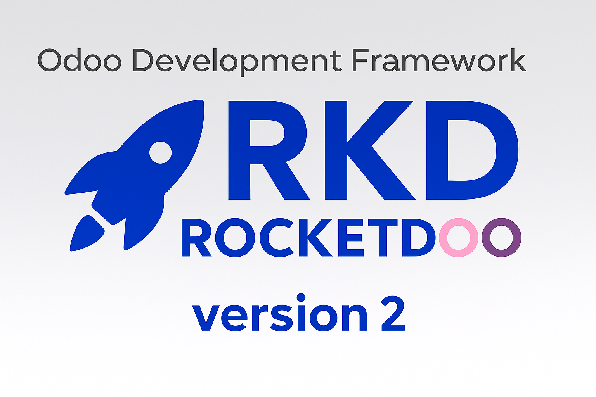

# ¡Bienvenido a RKD como ROCKETDOO!

> Ahora la version 2 de ROCKETDOO con su alias RKD

Rocketdoo es un framework desarrollado en Python que tiene como objetivo proporcionar un entorno de desarrollo rápido y eficiente.

Con Rocketdoo podrás desplegar, en simples pasos, uno o varios entornos para desarrollar en Odoo, en todas sus ediciones y versiones.  
Te permitirá crear nuevos módulos o funcionalidades tanto para la edición Enterprise como para la edición Community.

## Novedades en la version 2 de ROCKETDOO

La nueva version de **ROCKETDOO** ahora nos permite instalar el framework y poder comenzar a usar la herramienta sin la necesidad
de tener que crear un repositorio desde el antiguo template de la version 1.3.1
Ya que a partir de esta version no es mas un repositorio como tal, nos va a quitar el peso de tener que usar submodulos de ***Git***,
algo que quizas para muchos haya significado una complejidad extra. 

A partir de esta version podras clonar de manera mas natural tus modulos a desarrollar y desarrollados, simplemente en la carpeta ***addons/***
destinada para tal ocasion.

Ademas en la nueva version como bien lo indica el titulo, **ROCKETDOO** cuenta con su propio alias para mayor agilidad, **RKD** se suma 
a la herramienta para sustituir el comando ***rocketdoo*** y simplificar el tipeo con ***rkd*** cumpliendo con las mismas funciones; Pero
sin dejar de lado el comando original, ya que se pueden usar ambos segun necesidad.

**RKD** como **ROCKETDOO** tambien nos trae ahora sus propios comandos. Una vez instalada la herramienta puedes verificar los comandos
disponibles y su uso ejecutando 
~~~~
rkd --help
~~~~
o su comando original

~~~~
rocketdoo --help
~~~~

Una buena noticia para quienes no dominen a la perfeccion docker y docker compose, **Rocketdoo** tambien nos trae los comandos mas importantes 
para poder ejecutar y dar inicio al despliegue, reemplazando los comandos mas naturales de docker y docker compose como lo son el comando para
levantar una intancia como, ***docker compose up -d*** ahora lo podes hacer con el comando simple, ***rkd up -d***, y asi con los comandos que 
permiten frenar, borrar y obtener log de nuestros contenedores.

> ¡Ahora si! Rocketdoo es mas potente y facil de usar...

## Descripción General

Esta herramienta fue diseñada para desarrolladores que están comenzando con Odoo, así como para aquellos con más experiencia que buscan desplegar sus entornos rápidamente y centrarse únicamente en crear nuevos módulos y funcionalidades.

Es importante destacar que Rocketdoo es una herramienta más dentro del ecosistema de desarrollo en Odoo. No pretende ser la única ni la mejor opción, sino una solución práctica que busca aportar valor, cubrir necesidades comunes del proceso de desarrollo y al mismo tiempo optimizar y automatizar el tiempo de trabajo de un desarrollador.

Sabemos que el ERP Odoo es un sistema amplio, con gran alcance y complejidad. Según el cliente, la necesidad o la localización a implementar en el sistema, es necesario contemplar una serie de requerimientos que van más allá del desarrollo en sí. Estos requisitos adicionales pueden incluir bibliotecas necesarias en Python, dependencias específicas para ciertas funcionalidades, módulos de terceros, o repositorios externos que permitan afrontar exitosamente un desarrollo.

Todo este conjunto de requerimientos y configuraciones suele ser una verdadera carga para los desarrolladores.

Por estas razones nace la idea de crear un entorno automatizado e intuitivo, que sirva tanto a desarrolladores individuales como a equipos de trabajo. Rocketdoo alivia la tarea de iniciar un entorno de desarrollo y permite enfocarse en lo esencial: desarrollar nuevos módulos o funcionalidades.

## Descripción

Para comprender mejor qué es Rocketdoo y cómo utilizarlo correctamente, daremos una breve descripción de las herramientas necesarias y cómo usarlas.

Primero, debemos mencionar que Rocketdoo fue pensado y desarrollado para crear entornos de desarrollo en sistemas operativos Linux, en sus diferentes distribuciones, como Ubuntu o Debian. Consideramos que es el sistema más adecuado para trabajar con este framework por las siguientes razones.

Rocketdoo utiliza las siguientes herramientas para cumplir su función:

* Docker y Docker Compose.
* Git y GitHub (o cualquier gestor de control de versiones).
* Llave SSH para gestión de repositorios privados.
* Gitman.
* Python y su gestor de paquetes `pip` o `pipx`.
* Uso de terminal CLI.
* Visual Studio Code.
* Extensiones necesarias para Visual Studio Code (más adelante listaremos las recomendadas).

Esta lista de herramientas necesarias —especialmente Docker y Docker Compose— es una de las razones por las cuales recomendamos usar Rocketdoo en un sistema operativo Linux.

No obstante, entendemos que muchos programadores prefieren utilizar Windows. En ese caso, recomendamos usar exclusivamente el Subsistema de Linux para Windows en su versión 2: **WSL2**.
