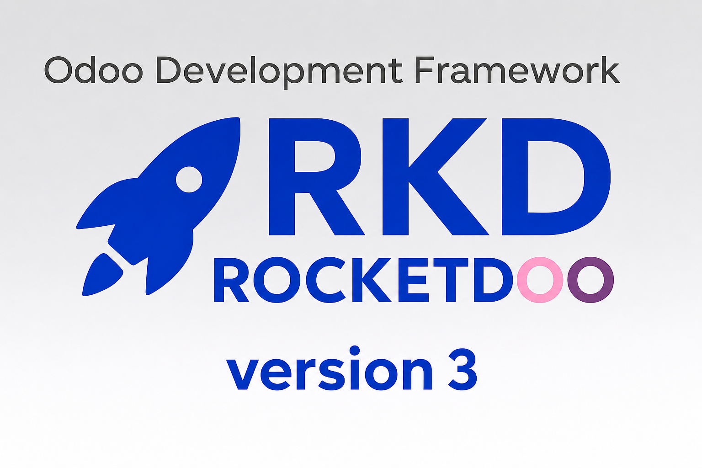
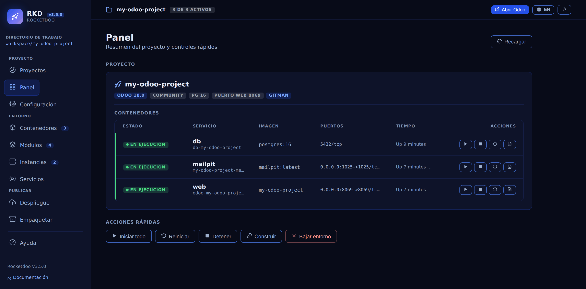

# ¡Bienvenido a RKD como ROCKETDOO!

> **Versión 3.5** de ROCKETDOO — una Interfaz Gráfica rediseñada, en español y en inglés, CI que generás para tu propio proyecto, y addons anidados que Odoo por fin alcanza — además de los golden paths, la integración Mailpit, el reverse proxy Traefik y el despliegue completo de instancias en VPS.

**Rocketdoo es una plataforma de desarrollo y entrega para equipos Odoo que estandariza, automatiza y abstrae el ciclo de vida de los entornos Odoo, desde el desarrollo local hasta el despliegue.**

Rocketdoo es un framework desarrollado en Python que tiene como objetivo proporcionar un entorno de desarrollo rápido y eficiente.

Con Rocketdoo podrás desplegar, en simples pasos, uno o varios entornos para desarrollar en Odoo, en todas sus ediciones y versiones.  
Te permitirá crear nuevos módulos o funcionalidades tanto para la edición Enterprise como para la edición Community.

## Novedades en la versión 3.5

### 🖥️ Una GUI que dice dónde estás, en tu idioma

La interfaz se rediseñó alrededor de lo que cambia mientras trabajás:

- **Una barra superior fija** con el proyecto activo y una pastilla que cuenta los contenedores
  corriendo, así ninguna pantalla te deja adivinando sobre qué proyecto estás actuando.
- **Navegación lateral agrupada** — Proyecto, Entorno, Publicar — más una pantalla **Proyectos**
  nueva que descubre todos los proyectos Rocketdoo del host y te deja cambiar entre ellos sin
  reiniciar el servidor.
- **Un tema claro que cumple contraste WCAG AA**, y sin una elección guardada la GUI sigue a tu
  sistema operativo en vez de arrancar siempre en oscuro.
- **Español e inglés**, con un botón en la barra superior. Lo que la GUI sólo reproduce — logs de
  Docker, nombres de addons, nombres de contenedor, el estado crudo de `docker compose ps` — queda
  intacto en los dos.

>>> [Las diez pantallas, con capturas](gui.md)

### ⚙️ CI para tu proyecto (`rkd ci`)

`rkd ci init` escribe un workflow de GitHub Actions **dentro de tu proyecto** que lintea tus addons
y los instala contra un Odoo real:

~~~
rkd ci init        # escribe .github/workflows/rkd-ci.yml
rkd ci prepare     # regenera lo que un clon limpio no trae
rkd ci modules     # los módulos instalables que Odoo alcanza
~~~

Nunca pisa un workflow que difiera de lo que escribiría, y el job caro —el de instalación— está
limitado a los pull requests por defecto, porque en repos privados los minutos de Actions son una
cuota compartida.

>>> [Qué hace el workflow generado, y qué queda afuera](command.md#integracion-continua-rkd-ci)

### 📁 Addons anidados que Odoo realmente alcanza

Odoo lee un `addons_path` estático, así que un módulo en `addons/oca/web_responsive` era invisible
salvo que ese subdirectorio estuviera listado. Ahora `rkd up`, `rkd restart`, `rkd build --rebuild`, `rkd ci prepare`, el Up de la GUI y el update
por módulo mantienen la ruta sincronizada con lo que hay bajo `addons/`; `rkd info` avisa sin
escribir.
Las entradas que no son de Rocketdoo — el default de Odoo, `enterprise`, el `external_addons` de
Gitman, tus propias rutas — se conservan tal cual y en su orden.

### 📧 `rkd mail` configura el servidor de correo, no sólo el transporte

**Desde la 3.3.** `rkd mail on` ahora también crea el registro `ir.mail_server` **`Mailpit (rkd)`** en tu base, para
que Odoo realmente enrute por Mailpit. `off` sólo lo archiva — nunca borra, así que un servidor de
correo tuyo no corre riesgo. Los proyectos con más de una base necesitan `--db NOMBRE`.

>>> [El registro, el flag `--db` y un límite conocido](command.md#el-servidor-de-correo-en-odoo)

### 🔑 La GUI pide un token de sesión

Desde la 3.4, cada `rkd gui` imprime una URL que lleva un token de sesión, y la API rechaza todo lo
que no lo traiga. El token vale mientras ese servidor siga corriendo, y reiniciarlo emite uno nuevo. **Entrar a `http://localhost:8070` a secas ya no funciona** — usá la URL
que imprime, o `--open`.

>>> [Por qué, y de qué no protege](gui.md#el-token-de-sesion)

---

## Novedades en la versión 3.2

La versión 3.2 no agrega un subsistema nuevo: hace predecibles los que ya existen.

### 🧭 Golden Paths (`rkd profiles`)

Un *golden path* es una combinación soportada, con nombre propio, de versión de Odoo, edición y
versión de PostgreSQL. Rocketdoo trae diez — Odoo 15 a 19, Community y Enterprise — y ahora son la
fuente de verdad tanto del asistente como de la configuración no interactiva:

~~~~
rkd profiles list              # la matriz completa
rkd profiles show odoo18-ce    # detalle de un perfil
rkd init --profile odoo18-ce   # crear el entorno sin responder preguntas
~~~~

Tres de ellos (`odoo15-ce`, `odoo18-ce`, `odoo19-ee`) los construye el CI en cada PR de release; el
resto es best effort. La compatibilidad Odoo↔PostgreSQL ahora se valida, así que el asistente ya no
puede armar una combinación no soportada — Odoo 19, por ejemplo, requiere PostgreSQL 13 o superior.

>>> [La matriz completa y los niveles de soporte](command.md#golden-paths-rkd-profiles)

### ✅ Suite de tests y un gate de CI real

Rocketdoo ahora tiene una suite `pytest` de más de 900 tests, más `ruff` para lint, que corre en cada
pull request sobre Python 3.10 a 3.13, con tests end-to-end con Docker, verificación del build del
paquete y una pasada de render y build sobre los golden paths. Ya no queda ningún
`continue-on-error`: un job en rojo significa que el cambio no se mergea.

>>> [Cómo correrla antes de abrir un PR](collaborate.md)

### 🔧 Correcciones que justifican actualizar

- **El build de Docker fallaba en Odoo 18 y 19.** El `Dockerfile` generado borraba el marcador PEP 668
  en una capa propia, pero `apt install python3-dev` arrastra el paquete `python3.N`, que vuelve a
  colocar el archivo — así que el `pip install` posterior moría con `externally-managed-environment`.
  Solo las imágenes Ubuntu noble (`odoo:18.0`, `odoo:19.0`) traen ese marcador, y por eso las
  versiones anteriores no se veían afectadas. Ahora el CI construye las cinco imágenes.
- **`rkd pack` fallaba siempre con `UnboundLocalError`** al usarlo con `--no-db`, o antes de que
  existiera alguna base de datos — las dos formas normales de usarlo. Presente en 3.1.8 y anteriores.
- **La API de la GUI aceptaba peticiones de cualquier origen.** `rkd gui` ahora solo acepta llamadas
  desde su propio origen. Bindear a `127.0.0.1` nunca protegió de esto: la petición la hace el
  navegador del propio usuario, así que cualquier página visitada mientras corría la GUI podía listar
  el filesystem y bajar los contenedores.

---

## Novedades en la versión 3 de ROCKETDOO

La versión 3 es la entrega más completa de **ROCKETDOO** hasta la fecha. Conserva todo lo de la versión 2 y agrega cuatro grandes capacidades nuevas:

### 🖥️ Interfaz Gráfica (GUI)

**Rocketdoo v3** incluye su propia GUI web, que se lanza directamente desde la terminal con un solo comando:

~~~~
rkd gui
~~~~

La GUI se abre en tu navegador en la URL que imprime `rkd gui` — desde la 3.4 esa URL lleva un
token de sesión — y ofrece:

- **Dashboard** — resumen del proyecto con estado de contenedores, versión de Odoo, PostgreSQL y accesos rápidos.
- **Control de contenedores** — iniciar, detener, reiniciar, construir, descargar y eliminar contenedores sin escribir comandos Docker.
- **Visor de logs en vivo** — streaming en tiempo real de los logs de cualquier contenedor.
- **Mail (Mailpit)** — activar/desactivar el servicio de pruebas de email desde la interfaz.
- **Módulos** — listar y gestionar módulos add-on de Odoo.
- **Deploy** — ejecutar operaciones de despliegue desde la GUI.
- **Instance** — gestionar los destinos de despliegue en VPS.
- **Pack / Unpack** — compartir o restaurar entornos completos de desarrollo.
- **Gitman** — gestionar dependencias de repositorios de terceros.
- **Traefik** — configurar la integración del reverse proxy.
- **Modo oscuro y claro** — alternar el tema según tu preferencia.

>>> [Más información sobre la GUI](gui.md)

### 📧 Testing de Email con Mailpit (`rkd mail`)

El nuevo comando `mail` integra [Mailpit](https://github.com/axllent/mailpit) — un servidor SMTP local con interfaz web que captura todos los emails salientes de Odoo en lugar de enviarlos.

~~~~
rkd mail on       # Activar Mailpit y configurar SMTP en Odoo
rkd mail off      # Desactivar Mailpit y restaurar los valores por defecto
rkd mail status   # Ver el estado actual
rkd mail open     # Abrir la interfaz web de Mailpit en el navegador
~~~~

### 🌐 Reverse Proxy Traefik (`rkd traefik`)

El comando `traefik` facilita exponer tu instancia local de Odoo con un dominio personalizado, tanto para desarrollo local como para producción con HTTPS y Let's Encrypt.

~~~~
rkd traefik on      # Configuración interactiva: dominio, modo (local/producción)
rkd traefik off     # Quitar la integración Traefik del proyecto
rkd traefik status  # Ver la configuración actual de Traefik
rkd traefik guide   # Guía paso a paso para configurar dominios locales
~~~~

### 🚀 Despliegue Completo en VPS (`rkd instance`)

El comando `instance` permite desplegar una instancia completa de Odoo en un VPS, ya sea como contenedor Docker o instalación nativa, mediante un asistente interactivo.

~~~~
rkd instance init                # Configurar entornos stage/prod de forma interactiva
rkd instance deploy --env stage  # Desplegar en staging
rkd instance deploy --env prod   # Desplegar en producción
rkd instance status              # Ver los destinos de despliegue configurados
~~~~

---

## Desde la Versión 2 — Todo Disponible

Todas las funcionalidades de **ROCKETDOO v2** se mantienen intactas:

- `rkd scaffold` / `rkd init` — scaffolding del proyecto y asistente de configuración.
- `rkd up`, `rkd down`, `rkd restart`, `rkd stop`, `rkd build`, `rkd status`, `rkd logs` — gestión de contenedores Docker.
- `rkd pack` / `rkd unpack` — compartir y restaurar entornos completos.
- `rkd del -i` — limpiar archivos `.Identifier` generados por WSL2.
- `rkd deploy` — despliegue de módulos a Odoo SH, VPS o instancias dockerizadas.

En la siguiente página encontrarás todos los detalles sobre los despliegues con **rkd**. >>> [Despliegue](deployment.md)

> ¡Rocketdoo v3 es más potente y fácil de usar que nunca!

## Descripción General

Esta herramienta fue diseñada para desarrolladores que están comenzando con Odoo, así como para aquellos con más experiencia que buscan desplegar sus entornos rápidamente y centrarse únicamente en crear nuevos módulos y funcionalidades.

Es importante destacar que Rocketdoo es una herramienta más dentro del ecosistema de desarrollo en Odoo. No pretende ser la única ni la mejor opción, sino una solución práctica que busca aportar valor, cubrir necesidades comunes del proceso de desarrollo y al mismo tiempo optimizar y automatizar el tiempo de trabajo de un desarrollador.

Sabemos que el ERP Odoo es un sistema amplio, con gran alcance y complejidad. Según el cliente, la necesidad o la localización a implementar en el sistema, es necesario contemplar una serie de requerimientos que van más allá del desarrollo en sí. Estos requisitos adicionales pueden incluir bibliotecas necesarias en Python, dependencias específicas para ciertas funcionalidades, módulos de terceros, o repositorios externos que permitan afrontar exitosamente un desarrollo.

Todo este conjunto de requerimientos y configuraciones suele ser una verdadera carga para los desarrolladores.

Por estas razones nace la idea de crear un entorno automatizado e intuitivo, que sirva tanto a desarrolladores individuales como a equipos de trabajo. Rocketdoo alivia la tarea de iniciar un entorno de desarrollo y permite enfocarse en lo esencial: desarrollar nuevos módulos o funcionalidades.

## Descripción

Para comprender mejor qué es Rocketdoo y cómo utilizarlo correctamente, daremos una breve descripción de las herramientas necesarias y cómo usarlas.

Primero, debemos mencionar que Rocketdoo fue pensado y desarrollado para crear entornos de desarrollo en sistemas operativos Linux, en sus diferentes distribuciones, como Ubuntu o Debian. Consideramos que es el sistema más adecuado para trabajar con este framework por las siguientes razones.

Rocketdoo utiliza las siguientes herramientas para cumplir su función:

* Docker y Docker Compose.
* Git y GitHub (o cualquier gestor de control de versiones).
* Llave SSH para gestión de repositorios privados.
* Gitman.
* Python y su gestor de paquetes `pip` o `pipx`.
* Uso de terminal CLI.
* Visual Studio Code.
* Extensiones necesarias para Visual Studio Code (más adelante listaremos las recomendadas).

Esta lista de herramientas necesarias especialmente Docker y Docker Compose— es una de las razones por las cuales recomendamos usar Rocketdoo en un sistema operativo Linux.

No obstante, entendemos que muchos programadores prefieren utilizar Windows. En ese caso, recomendamos usar exclusivamente el Subsistema de Linux para Windows en su versión 2: **WSL2**.
