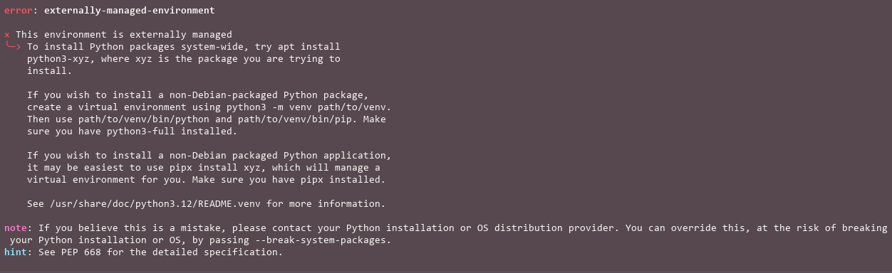

# Instrucciones de uso

En esta sección de la documentación prepararemos nuestra PC para comenzar a desarrollar en Odoo usando  
**ROCKETDOO**.

***Para los desarrolladores que prefieren trabajar con Windows y WSL2, como vimos en la página anterior, ya deberían tener su PC lista con todas las herramientas iniciales instaladas.***

Para quienes trabajan en sistemas operativos Linux, detallaremos las herramientas necesarias que deben tener instaladas para comenzar.

## Herramientas previas a Rocketdoo

1. Mantener los paquetes de Linux actualizados.
2. Tener instalado o verificar que tienes GIT instalado:

~~~
git --version
~~~

O instalarlo:

~~~
sudo apt install git -y
~~~

3. Tener instalado Visual Studio Code.  
4. Tener instalado el gestor de paquetes de Python `pip`.  
5. Instalar Docker y Docker Compose utilizando la guía oficial compartida en la página **Get Started**.  
6. Instalar en VSCode las extensiones básicas:
    - Docker
    - Dev Container

Y lo más importante es instalar el framework **ROCKETDOO**:

~~~
sudo pip install rocketdoo
~~~
o
~~~
sudo pipx install rocketdoo
~~~

> Recomendamos usar ***pipx*** si quieres que se instale en tu maquina en modo global sin romper dependencias de Python.

<a href="https://pypi.org/project/rocketdoo/" target=" blank">Official Rocketdoo PyPi</a>

---

## ¿Porque usar PIPX en lugar de PIP?

Es muy probable que si intenas instalar la herramienta **ROCKETDOO** con el comando tradicional **pip**, el mismo te devuelva
un error, con algunas sugerencias de instalacion. 
Esto se debe a los ultimos cambios realizados por Python **PEP 668**

## PEP 668

PEP 668 es una propuesta de mejora de Python (Python Enhancement Proposal) que marca los entornos base de Python como «administrados externamente» para prevenir conflictos de paquetes. Esto significa que el administrador del sistema operativo (como un distribuidor de Linux) gestiona los paquetes del sistema Python, mientras que el usuario debe usar entornos virtuales para sus proyectos individuales, en lugar de instalar o actualizar paquetes con pip directamente en el sistema. 

### En resumen:
- ¿Qué hace? Evita que los desarrolladores de Python instalen o actualicen paquetes directamente en el entorno del sistema operativo.
- ¿Por qué? Para evitar corromper o sobrescribir paquetes que son gestionados por el sistema, lo que podría romper la instalación del sistema. 
- ¿Cómo se soluciona? Para proyectos se debe usar un entorno virtual (como venv), y para aplicaciones independientes se puede usar pipx. 
- ¿Cuándo se implementó? En distribuciones de Linux, lo que genera un mensaje de error si se intenta usar pip para modificar el entorno de sistema.

Por esta razon, sugerimos que para poder tener instalado **ROCKETDOO** de manera global en tu computadora, para poder ejecutar un ambiente en cualquier
directorio creado para desarrollar, y no tengas ningun problema, usar **PIPX**

---

¡¡¡AHORA PODEMOS COMENZAR!!! >>>>>
