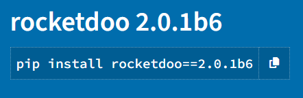

# Paso a Paso

### Paso 1:

Verifica tener instalado Docker y Docker Compose, ya que es una herramienta tan importante como la misma **Rocketdoo**

### Paso 2:

Instalar **Rocketdoo**

~~~~
pipx install rocketdoo==2.0.2b2
~~~~

>> IMPORTANTE SABER QUE POR EL MOMENTO SE LIBERA UNA VERSION BETA (Absolutamente funcional)
>> LUEGO DE UN TIEMPO CONSIDERABLE DE PRUEBAS SE PASARA A LIBERAR LA PRIMER VERSION ESTABLE DEL FRAMEWORK

<!--  -->

### Paso 3:

Instala los requerimientos del archivo ***requirements.txt*** si es que no se instalaron por defecto:

~~~
sudo pip install -r requirements.txt
~~~

### Paso 4:

Verifica la version instalada para estar seguro de que sea la version 2; ya la antigua version seguira disponible.

~~~~
rocketdoo --version
~~~~

### Paso 5:

Ahora ya puedes crear un directorio a gusto para comenzar. Sin embargo es recomendable que tu directorio haga referencia a
un desarrollo destinado a Odoo, creo que es lo mas logico, no ? 

### Paso 6:

Una vez creado tu directorio de trabajo, mantener el mismo vacio y una vez dentro de el, puedes ejecutar tu primer comando:

~~~~
rkd scaffold
~~~~
Este comando creara dentro de tu directorio de trabajo todos los archivos y carpetas necesarias para poder construir tu 
ambiente de desarrollo en Odoo y depurar codigo con VSCode.

### Paso 7:

Ejecuta el comando para dar inicio al asistente de **Rocketdoo**, el mismo te guiara paso a paso, sobre todo lo 
necesario para configurar tu ambiente de desarrollo. 
Sigue los pasos y responde todas y cada una de sus preguntas.

~~~
rkd init
~~~

### Paso 8:

Una vez finalizado el asistente podrias verificar como se construyo tu ambiente con el comando:

~~~~
rkd info
~~~~

### Paso 9:

Con el siguiente comando ya podras desplegar tu ambiente de desarrollo

~~~~
rkd up -d
~~~~

### Paso 10:

Una vez finalizado el despliegue exitosamente puedes acceder con tu navegador de preferencia con la url:
http://localchost:{puerto-odoo}

## NOTAS 

> Rocketdoo puede determinar si los puertos elegidos para Odoo como para la depuracion de codigo con Visual Studio Code, estan 
ocupados. De esta manera si los puertos elegidos se encuentran ocupados, el sistema te ofrecere dos puertos alternativos
o bien la opcion para que determines nuevos puertos a gusto.

> Si comentiste un error durante el asistente, puedes cancelar con la combinacion de teclas **CTRL + C** y volver a iniciar
sin mayores problemas.

## Conoce los comandos disponibles

Con el siguiente comando podras ver la ayuda: 

~~~~
rkd --help
~~~~

---

